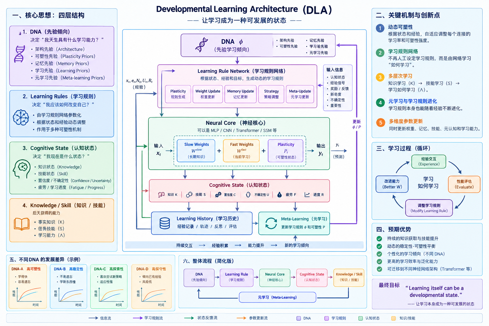

# DLA v0.2 — Developmental Learning Architecture



> 研究对象不是“再加一个 fast weight”，而是：**学习规则本身是否可以成为发育状态**。

当前论文主线（2026-09-08）：

```
Learning History → Learner State（Body） → Future Adaptation
```

---

## 一、这是什么

DLA 是一套“不修改 Transformer 骨架”的发育式学习机制。它给标准权重旁边挂上：

| 状态 | 含义 |
|---|---|
| `W_slow` | 长期知识（慢权重，睡眠巩固） |
| `W_fast` | 当前学习轨迹（快权重） |
| `P` | 逐参数可塑性（学习能力本身可变） |
| `Q` | 慢权重资格迹（睡眠时巩固什么） |
| `m/v` | 快权重 Adam 力矩 |

有效权重：

```
W_eff = W_slow + softplus(P) * W_fast
```

快权重只负责“当下学到的经验”；睡眠时把可巩固的部分写回慢权重并衰减快权重。骨架（MLP 或 GPT）本身不改。

---

## 二、最重要的实验结果

### ✅ 已证实 / 强证据

1. **Fast/Slow 分离能保护记忆（Stage 4 Formal，5 seeds）**
   - DLA 与调好参的 AdamW 适应能力持平：B 域 gain **+14.0% vs +13.0%**
   - 慢记忆层对旧域遗忘 **≈ 0**（−0.4%）

2. **Learning history shapes the future learner（A 命题）**
   - `hard→easy` 历史比 `easy→hard` 历史在未见域 D 上表现更好（10 seeds 可重复）

3. **W_fast 是 history effect 的因果载体之一（Stage 5.5e P0，n=12）**
   - 把 EH 的 `W_fast` 注入 HE body：未来学习显著被破坏
   - gain@40 配对差 **−0.0195**，Cohen’s d **−0.80**，bootstrap CI 不含 0，p=0.019

### ⚠️ 不支持 / 未证实

1. **9 维 tempo φ 不是 carrier（Stage 5.5c）**
   - Body×φ cross-injection：换 body 影响大，换 φ 影响小且不稳定

2. **“越学越快”（B 命题）目前不成立**
   - Stage 5 递进课程：LE 无上升
   - Stage 6 同难度纵向：7/10 方向但 p=0.17
   - Stage 7 跨领域 10 任务（20 seeds）：回归斜率≈0，p=0.82
   - Stage 8 物理近迁移（20 seeds）：d=−0.17
   - Effective Rank：EH/HE 无显著差异；MLP 层 p=0.064（边界趋势）

### 总结论

> **A 命题有较强证据：历史经历通过 W_fast 改变未来学习者。**
> **B 命题（更多经历 → 更快学会新任务）没有得到实验支持。**

---

## 三、实验阶段速查

| 脚本 | 实验 | 关键结论 |
|---|---|---|
| `stage1_adaptive_plasticity.py` | 静态 MLP vs 自适应可塑性 | 遗忘减半 |
| `stage2_learned_rule.py` | 固定 Hebbian vs 学到的 F_phi | 学到规则更优 |
| `stage3_learning_rule_development.py` | φ 固定 vs φ 发育 | 稳定性改善，Λ_t 无上升 |
| `stage4_formal.py` | Transformer + AdamW LR sweep，5 seeds | 慢记忆零遗忘 |
| `stage5_progressive_curriculum.py` | 递进课程 + Λ_t | 难度归一化后不崩坏 |
| `stage55*` | φ / body / W_fast 因果拆解 | W_fast 是主要 carrier |
| `stage6_longitudinal.py` | 同难度纵向 | B 弱方向不显著 |
| `stage7_cross_domain.py` | 跨领域 10 任务，20 seeds | B 不成立 |
| `stage8_physics.py` | 物理近迁移，20 seeds | B 不成立 |
| `analysis/*.py` | Effective Rank 等 | EH/HE 秩无显著差异 |

---

## 四、仓库结构

```
dla/
  config.py            配置与信号定义
  model.py             MLP 版 DLA（含 F_phi 学习规则网络）
  transformer_dla.py   Transformer 版 DLA（W_fast/P/Q/m/v）
  meta.py              元学习（lifetime unroll / adapter）
  tasks.py             合成任务
  metrics.py           终身评估指标
  baselines.py         StaticMLP / Hebbian 对照
  dna.py               DNA 先验变体
experiments/
  stage1..stage8       分阶段实验脚本（见上表）
analysis/
  compute_wfast_effective_rank.py
  compute_wfast_decompose_rank.py
paper/
  DLA_paper_draft.md   Markdown 初稿（含图）
  DLA_paper.tex        LaTeX 版
  md2pdf.py            Markdown → PDF 本机脚本
  overnight_report.md  最新实验结果汇总
docs/
  experiments.md       分阶段详细结果与判定
  architecture.png     架构图
results/               服务器结果（JSON/PNG）
```

---

## 五、运行

服务器：`wust_1@192.168.2.2`，环境 `~/llm-lab/venv`。

```bash
cd ~/llm-lab/dla-v0.2

# 测试
~/llm-lab/venv/bin/python tests/test_core.py

# Stage 7（跨领域 10 任务，20 seeds）
bash experiments/stage7_run_all.sh

# Stage 8（物理近迁移，20 seeds，切片 100k+10k）
bash experiments/stage8_run_20.sh

# 单 seed 快速跑
~/llm-lab/venv/bin/python experiments/stage8_physics.py --seeds 0 --max-steps 40 \
  --train-chars 100000 --val-chars 10000 --out results/stage8_physics_test
```

---

## 六、论文与复现

- 论文初稿：`paper/DLA_paper_draft.md`
- 最新结果与判定：`paper/overnight_report.md`
- 详细实验表：`docs/experiments.md`
- GitHub：https://github.com/JayCRL/DLA

---

## 七、诚实声明

- 当前是 6.59M 中文 nanoGPT / MLP 上的机制研究。
- A 命题（history shapes future learner）有较强因果证据。
- B 命题（more experience → faster learning）在所有纵向实验中未获支持。
- 睡眠巩固写入 `W_slow` 的量仍很小；Fast/Slow 分离主要靠隔离，而非强巩固。
