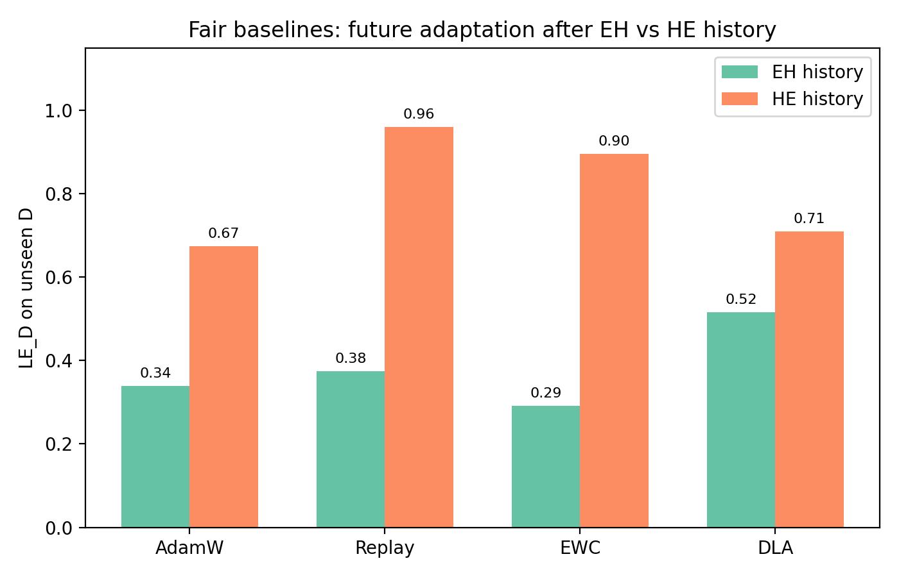

# Developmental Learning Architecture: Learning History, Fast-Weight Traces, and Future Adaptation

**First author: Yang Liu**

**Draft v0.3 (mechanism-audit) — workshop/arXiv**

---

## Abstract

A conventional neural learner is treated as a fixed function trained once by an external optimizer. This paper studies a more developmental question: does a learner's prior learning history change how it will learn in the future, and *which part of the learner* carries that change? We use DLA, an architecture that keeps a standard Transformer backbone unchanged but augments every weight with a fast trace `W_fast`, a per-parameter plasticity `P`, and sleep-boundary consolidation, so the learner's own state (not its architecture or its task list) is the object of study. On a 6.59M Chinese character GPT we establish three things. (i) *Where history lives:* replacing a hard→easy learner's `W_fast` with an easy→hard learner's significantly degrades future adaptation on an unseen domain (n=12, gain@40 difference ≈−0.019, CI excludes zero, sign p=0.019, 10/12 negative); norm-matched, shuffled and module-localized controls show the effect is not magnitude, randomness, or a single embedding/attention/MLP module. (ii) *What the mechanism is not:* an explicit code audit shows DLA contains no alignment objective and no parameter-level selection — its `success` signal is a global scalar, and the success-gated eligibility trace `Q` is numerically (~0.4% of the write energy) and causally inert. (iii) *What the mechanism is:* the history effect is carried by (a) the self-organized directional trace that `W_fast` integrates from its Adam-shaped gradients, whose per-seed alignment with the future gradient predicts adaptation (r=0.87; survives norm-confound controls and module-localizes to the same MLP/attention modules implicated causally), and (b) the direct fast→slow write at task boundaries, whose **coordinate allocation is functionally necessary**: keeping the write energy identical but shuffling which coordinates receive it removes the effect (n=12, paired t≈4.9), i.e. the system exhibits self-organized, allocation-level selectivity *without any selection objective*. We find no evidence that more experience monotonically accelerates learning (multiple controlled longitudinal null results).

---

## 1. Introduction

### 1.1 What problem exists

Modern neural networks are trained and then frozen. When they learn a second task, they either overwrite the first (catastrophic forgetting) or treat the two tasks as independent (Kirkpatrick et al., 2017; Zenke et al., 2017; De Lange et al., 2021). More fundamentally, standard training does not allow the model itself to become a different kind of learner: the learning algorithm is fixed outside the model, whether it is an external optimizer or a meta-learned rule (Andrychowicz et al., 2016; Miconi et al., 2019; Beaulieu et al., 2020).

We ask a problem that sits before "continual learning" and "meta-learning" — yet is closely tied to a long-standing empirical question about task and curriculum ordering (Poirier & Silver, 2005; Bell & Lawrence, 2022; Li & Hiratani, 2025):

> Can what a model has experienced change how it will learn in the future, and which part of the model carries that developmental change?

### 1.2 Why it matters

If learning history only changes stored knowledge, the learner remains a static function with a growing database. If learning history also changes the learner state, then a small model could, in principle, become a better learner through experience—without changing its architecture. This developmental framing has a deep biological precedent: complementary learning systems (CLS) theory explains memory/learning trade-offs by the interaction of a fast hippocampal system and a slow neocortical system, consolidated over time (McClelland, McNaughton & O'Reilly, 1995; Kumaran, Hassabis & McClelland, 2016). Recent empirical results further show that plasticity itself is a fragile resource that ordinary training can consume (Dohare et al., 2024; Lyle, Rowland & Dabney, 2022; Nikishin et al., 2022), so "what kind of learner a model is" is not fixed by its architecture alone.

The practical significance is twofold. First, it tells us which parts of a model to preserve or transfer between learning phases. Second, it gives a falsifiable framework for claims such as "more experience makes models learn faster" — a claim we test and do not find support for. Throughout, we treat every mechanistic claim as a diagnosis: we state at which level it is established (causal, controlled, correlational, or absent) rather than over-claiming a mechanism.

---

## 2. How existing work addresses the problem

- **Catastrophic forgetting methods** (regularization, replay, EWC, pseudorehearsal) address memory, not the change of the learner itself (Kirkpatrick et al., 2017; Zenke et al., 2017; Robins, 1995; De Lange et al., 2021).
- **Fast-weight models** add a temporary memory but usually keep the learning rule external. The idea goes back to fast-weight memories (Hinton & Plaut, 1987; Ba et al., 2016) and has seen a modern revival: linearised attention is formally equivalent to fast-weight programming (Schlag, Irie & Schmidhuber, 2021), in-context learning can be understood as implicit gradient descent / fast-weight updates inside a Transformer (von Oswald et al., 2023), and recent sequence models introduce trainable "neural memory" modules with fast updates alongside slow base weights (Behrouz, Zhong & Mirrokni, 2025). Fast/slow dual-module designs also appear in RLHF pipelines ("fast-slow chasing" in online DPO; Qi et al., 2024). In most of these, the fast store is either a memory mechanism or an engineering device; DLA instead treats fast/slow as a *developmental state* whose history we causally dissect.
- **Complementary learning systems and consolidation.** CLS theory attributes the complementary benefits of fast, instance-based and slow, generalising stores to their interaction and to offline consolidation (McClelland et al., 1995; Kumaran et al., 2016). Machine-learning instantiations usually realise this as experience replay; DLA instantiates the fast/slow split as an internal, per-parameter weight state with sleep-boundary consolidation and no external replay buffer.
- **Meta-learning** optimizes a learning rule over many episodes; it asks whether a rule can be learned, but rarely whether one individual's rule develops within a single lifetime (Andrychowicz et al., 2016; Beaulieu et al., 2020).
- **Learned plasticity** (differentiable plasticity, ANML) shows that plasticity can be meta-learned, but does not separate *body state* from *learning-rule parameters* as causal carriers (Miconi et al., 2019; Beaulieu et al., 2020). Complementary findings that plasticity degrades over long training—capacity loss and primacy bias—motivate making plasticity itself a state to maintain (Dohare et al., 2024; Lyle et al., 2022; Nikishin et al., 2022).
- **Task and curriculum ordering.** The order in which tasks are learned measurably changes continual-learning outcomes and the amount of forgetting (Bell & Lawrence, 2022; Li & Hiratani, 2025), affects the consolidation of task knowledge (Poirier & Silver, 2005), and is the core object of curriculum learning (Wang, Chen & Zhu, 2022). This literature mostly measures order effects on *stored knowledge* about seen tasks. We ask a complementary question: does order change the *learner state* itself, such that future adaptation to a *never-seen* task changes—and which state component carries that effect?
- **We therefore design DLA** to ask a mechanistic question that is usually skipped: given the same task sequence, which state component carries history-dependent future adaptation?

---

## 3. Our solution: DLA

### 3.1 Design principle

We do not modify the Transformer skeleton. Instead, each weight matrix is accompanied by:

- `W_slow`: long-term consolidated knowledge (the base weights)
- `W_fast`: a fast learning trace
- `P`: per-parameter plasticity
- `Q`: a sleep eligibility trace

Effective weights:

```
W_eff = W_slow + softplus(P) * W_fast
```

Structurally, this additive form resembles parameter-efficient transfer methods that freeze a base network and attach small trainable additive weights—adapters (Houlsby et al., 2019), LoRA (Hu et al., 2021), and the unified additive-PEFT view (He et al., 2022). DLA differs in three ways that matter for development: (i) the additive pathway is a *within-lifetime developmental state* updated online by the learner's own wake/sleep dynamics, not a separately fine-tuned module; (ii) it is shared across tasks and persists (subject to decay and consolidation) rather than being re-initialised per task; and (iii) its contribution is gated per parameter by a learned plasticity `softplus(P)`. The fast/slow decomposition follows complementary learning systems theory (McClelland et al., 1995; Kumaran et al., 2016).

### 3.2 Wake and sleep (exact update rules used in this paper)

**Wake step** (per batch, per parameter matrix):
```
g        = dL/dW_eff                    (backprop)
m <- b1 m + (1-b1) g ; v <- b2 v + (1-b2) g*g     (Adam moments)
adam     = m_hat / (sqrt(v_hat) + eps)
dw       = -eta_fast * softplus(P) * adam - fast_decay * W_fast
W_fast  += dw
dp       = eta_plast * progress * relevance - stability*(P - P0)
success  = clamp((loss_ema - loss)/(loss_ema+1e-4), 0, 1)   # GLOBAL scalar
Q        = (1 - alpha_q) Q + alpha_q * (dw * success)
```
`success` is one scalar shared by every parameter: the only "selection signal" in the code is step-level and global; there is no per-parameter or per-subspace term in Q.

**Sleep (task boundary)** — two write pathways into `W_slow`:
```
W_slow += beta * Q  +  gamma * W_fast     # Q pathway  +  DIRECT fast->slow
W_fast *= consolidate_fast_decay
Q      *= consolidate_q_decay
reset Adam moments
```
with `beta ≈ 1.0`, `gamma ≈ 0.15`, decay 0.5/0.7 (config values used at probe time; probes run with default rule parameters). The second term is an explicit **unselected bypass**: `W_fast` is copied into `W_slow` at a uniform coefficient regardless of any gate.

**Algorithm 1: DLA wake–sleep cycle**
```
1: for task t in curriculum do
2:   for step in 1..T do
3:     compute g = dL/dW_eff
4:     update W_fast with Adam(g), gated by softplus(P)
5:     update P from progress/relevance; Q += dw * success (global scalar)
6:   end for
7:   consolidate: W_slow += beta*Q + gamma*W_fast
8:   decay: W_fast *= c, Q *= d ; reset moments
9: end for
```

### 3.3 Experimental design to isolate development

To test whether history changes the future learner, we:
1. Build two histories with the same three domains but different order: easy→hard (EH) and hard→easy (HE).
2. Probe each individual on a never-seen domain `D`.
3. Perform body/component cross-injection to see which state component transfers the history effect.
4. Run norm-matched, shuffled, and module-localized controls to rule out magnitude/randomness.
5. Compare with standard baselines (AdamW, replay, EWC).
6. Run consolidation-pathway ablations (Q-only / direct-only / none) and an energy-matched **allocation shuffle** to ask whether consolidation—and, if so, *where* it writes—matters.
7. Audit the code statically for the presence of explicit alignment or selection objectives.

---

## 4. Experimental setup

Primary backbone: 6.59M Chinese character GPT (6 layers, 8 heads, 256 dim, vocab 7280), pretrained on Chinese Wikipedia. Curriculum domains: Wikipedia, SFT-style QA, science Wikipedia; unseen domain D is a science slice. Second setting: ~10.65M Shakespeare character GPT (vocab 65). Metrics: gain@40, LE_D, T80, paired t / bootstrap CI, sign test. All within-seed, within-arm contrasts are paired; raw EH/HE differences are reported with their own variance and are not assumed stable across seeds.

**Table 1: Common experimental hyperparameters.**

| Hyperparameter | Value |
|---|---|
| Block size | 128 |
| Batch size | 32 |
| Steps per task | 40 |
| AdamW learning rate (baselines/DLA base) | 1e−4 |
| EWC lambda | 1e3 |
| Replay buffer capacity | 48 batches |
| Seeds (primary setting, causal/ablation) | 12 (0–11) |
| Seeds (baselines) | 5 |
| Seeds (second setting) | 2 |
| Consolidation coefficients (beta, gamma, decays) | ≈1.0, 0.15, 0.5, 0.7 |

---

## 5. Results: how well does it work

### 5.1 Fast/slow separation protects consolidated memory

DLA matches tuned AdamW on new-domain adaptation (gain +14.0% vs +13.0%) while slow-memory forgetting is ≈0 (−0.4%). The mechanism does not sacrifice memory for plasticity.


### 5.2 Learning history changes future adaptation

Across histories, HE learners adapt better to unseen D than EH learners on average, mirroring continual-learning and curriculum order effects measured on seen tasks (Bell & Lawrence, 2022; Li & Hiratani, 2025; Poirier & Silver, 2005). The distinctive feature is that D was never seen in either history, so the order effect must act through the learner's internal state rather than stored content about D. The raw EH/HE gap is **not stable across seeds** (n=12 paired HE−EH dz≈0.6; several seeds reverse), so every strong claim below uses *within-seed, within-arm* contrasts (swap, ablation, shuffle), not the raw gap.


### 5.3 The effect is not carried by the learning-rule parameters φ

Body×φ cross-injection shows that swapping φ between histories changes future adaptation much less than swapping body state. φ is not a stable/dominant carrier in this setting.


### 5.4 W_fast is a causal component (carrier localization)

Core result (n=12):

| condition | mean gain@40 |
|---|---|
| HE/HE | +0.014 |
| HE + EH W_fast | −0.005 |

Paired contrast: mean −0.019, 95% CI [−0.033, −0.005], Cohen's d ≈ −0.7, sign p=0.019 (10/12 negative). Initial PPL differences are small; the effect appears in the adaptation trajectory.


### 5.5 Controls: magnitude, randomness, module

| control | mean Δ gain@40 | 95% CI | d |
|---|---|---|---|
| raw EH W_fast | −0.019 | [−0.034, −0.005] | −0.71 |
| norm-matched EH W_fast | −0.022 | [−0.034, −0.009] | −0.90 |
| shuffled EH W_fast | −0.017 | [−0.023, −0.009] | −1.25 |
| EH embedding W_fast | −0.006 | [−0.009, −0.002] | −0.87 |
| EH attention W_fast | −0.012 | [−0.018, −0.006] | −1.06 |
| EH MLP W_fast | −0.017 | [−0.025, −0.008] | −1.05 |

Norm-matching does not rescue the effect; shuffling also does not remove it. Module localization is suggestive of MLP and attention, with embedding weaker.


### 5.6 Fair baselines

| method | EH | HE | HE−EH |
|---|---|---|---|
| AdamW | 0.339 | 0.675 | +0.336 |
| AdamW+replay | 0.375 | 0.961 | +0.586 |
| EWC | 0.292 | 0.895 | +0.603 |
| DLA | 0.517 | 0.709 | +0.192 |

DLA is the most robust after an easy→hard history; standard learners show larger HE performance but larger EH degradation.



### 5.7 Second-setting replication

Shakespeare char GPT, 2 seeds: HE/HE gain@40 +0.052/+0.042; HE+EH fast +0.004/−0.001. The destructive effect replicates in direction (n=2, exploratory).

### 5.8 Negative result: more experience does not necessarily make learning faster

Stage 5 (difficulty-normalized): flat LE. Stage 6 (matched difficulty): p=0.17. Stage 7 (cross-domain, 20 seeds): p=0.82. Stage 8 (physics near-transfer, 20 seeds): d=−0.17. We do not claim "more experience → faster learning". This null is consistent with a growing plasticity literature (Nikishin et al., 2022; Lyle et al., 2022; Dohare et al., 2024).


---

## 6. Mechanism audit: what the effect is, and what it is not

### 6.1 There is no explicit alignment or selection mechanism in the code

A static audit of the full wake/sleep/meta path (`dla/transformer_dla.py`: `dla_step`, `dla_sleep`, `meta_unroll_loss`) shows:
- **No alignment objective.** No term compares a gradient to a history direction; no cosine/normalized-dot exists anywhere in the Transformer-DLA path.
- **No parameter-level selection.** `success` is a single scalar from EMA losses (same coefficient for every parameter); `Q = EMA(dw · success)` is therefore a *step-level global gating*, not parameter- or subspace-level selection. The only per-parameter signal (`relevance`) feeds `P`, a positive coordinate rescale, never `Q`.
- The directional content that exists is **emergent**: `W_fast` is a leaky integrator (decay 0.02/step ⇒ ≈50-step horizon ≈ one stage) of the Adam-shaped gradient `-eta·softplus(P)·adam`, so the "direction of history" is an accumulated, normalised recent-gradient trajectory — not an imposed target.

### 6.2 The directional character is measurable, module-aligned, and not a norm artifact (correlational)

From 48 deterministic replays of the stored D-probe and the 24 saved bodies (seeds 0–11):
- The per-seed alignment `cos(g0(HE), ΔW_fast)` of the initial D-gradient with the same seed's history contrast predicts HE adaptation: r=0.87, permutation p≈0.000, leave-one-seed-out r∈[0.81,0.91], and it is the only effect in the correlation table surviving Benjamini–Hochberg FDR (q≈0.003).
- Controlling for `‖ΔW‖`, relative norm, `cos(EH,HE)`, and gradient norm leaves partial r≈0.77 — not a simple magnitude confound. True same-seed pairing (r≈0.86) beats cross-seed pairing (0.66) and shuffled Δ (0.30).
- Module alignment mirrors the causal module controls: MLP r≈0.87, attention r≈0.83, embedding r≈0.68.
- **Macroscopic geometry is not the carrier**: `‖ΔW_fast‖` and `cos(EH,HE)` are indistinguishable from same-history cross-seed noise (3.34 vs 3.21–3.26; 0.579 vs 0.60–0.61), and PCA shows no dominant shared direction (PC1 ≈ 20% variance).
- *Caveat:* this whole block is correlational; we do not claim directional alignment is causal (no direction manipulation in this paper).

### 6.3 Consolidation acts through the direct fast→slow write, not through Q

Measured on the saved bodies: mean `‖Q‖ ≈ 0.002` vs `‖W_fast‖ ≈ 3.6`; estimated Q→W_slow write is ≈0.4% of the direct write per sleep. During the D-probe `run_transfer` never calls sleep, so Q cannot act on the measured outcome except via earlier W_slow writes.

**Consolidation ablation (n=12, HE arm, gain@40):**

| variant | mean gain@40 | paired t vs full | paired t vs direct |
|---|---|---|---|
| full (archive) | +0.0143 | — | — |
| direct (γ·W_fast only) | +0.0148 | +0.59 | — |
| nocons (no write) | +0.0036 | −5.53 | +5.30 |
| qonly (β·Q only, n=4) | +0.0094 | — | ≈ nocons |

`direct ≈ full`; removing consolidation (`nocons`) significantly drops the HE arm; Q-only (n=4) behaves like no-consolidation ⇒ the success-gated Q channel has no independent causal contribution.

### 6.4 The coordinate allocation of the direct write is necessary (self-organized selective allocation)

Energy-matched control: `shufwrite` keeps every per-sleep write energy identical to `direct` but randomly permutes, within each matrix, which coordinates receive the increment (only the allocation is destroyed).

**HE arm, n=12:** `shufwrite` mean +0.0042 vs `direct` +0.0148 → paired t=4.86; `shufwrite` ≈ `nocons` (t=−0.38) ≪ `direct` (t=4.86).


Because the increment is just `γ·W_fast` with a uniform scalar coefficient, "where it writes" is entirely determined by the self-organized structure of `W_fast`. Destroying that structure with an energy-matched shuffle removes the benefit ⇒ the system shows **selectivity of allocation without any selection objective**: a form of emergent, allocation-level selective consolidation.

### 6.5 Statement-level summary

| Claim | Implemented in code? | Observed? | Causal evidence? | Status |
|---|---|---|---|---|
| History effect localized to `W_fast` (carrier) | — | yes | **strong** (swap, n=12, controls, 2nd setting) | established |
| Directional alignment as explicit operator/loss | no | — | — | absent |
| Emergent directional character (predictive, module-aligned) | — | yes (r=0.87) | correlational only | supported as *character*, not mechanism |
| Selective consolidation via success-gated Q | step-level scalar only | Q≈0.002; qonly≈nocons | inert | refuted in this setting |
| Direct fast→slow write carries effect | yes (γ·W_fast) | yes | strong (n=12, t≈5.3) | established |
| Allocation of the direct write is necessary | emergent from W_fast | yes | strong (energy-matched shuffle, t≈4.9) | established |
| More experience → faster learning | — | null (stages 5–8) | — | not supported |

---

## 7. Limitations

- Second-setting n=2; baselines n=5; all causal/ablation claims are from one 6.59M Chinese character GPT.
- Directional-alignment evidence is correlational (no direction manipulation).
- Retention (protection of earlier-task memory) is not measured in the same protocol as future adaptation (probes never sleep); the two halves of consolidation are separate in this paper.
- The raw EH/HE adaptation gap is seed-noisy; strong claims rest on within-seed paired contrasts.
- No pre-registration; we report n=10→n=12 and every null transparently.
- Sleep consolidation writes only a small amount into `W_slow` per boundary; the effect we attribute to the direct write is therefore about *where* the (small) write lands, not its bulk.

---

## 8. Conclusion and significance

Without any explicit alignment or selection objective, a learner's history still leaves a persistent, causal trace in its fast weights: replacing that trace changes how the learner will adapt to something it has never seen. Mechanistically, the trace is a self-organized directional structure (`W_fast` as a leaky integrator of its Adam-shaped gradients) whose per-seed alignment with the future task predicts adaptation and localizes to the same modules that are causally implicated; at task boundaries, the fast→slow direct write — not the success-gated eligibility trace — transfers part of that structure into the slow store, and *which coordinates* receive the write is functionally necessary (energy-matched shuffle control). The success-gated "selective consolidation" the architecture nominally contains is numerically and causally inert. We therefore reframe the contribution: not "fast/slow weights as a new mechanism", but a controlled, honest decomposition of *where* developmental change lives in a learner, *what* it consists of (emergent directional structure + allocation-selective writeback), and *what it does not consist of* (explicit alignment, parameter-level selection, or universally faster learning).

---

## Reproducibility

Code: https://github.com/JayCRL/DLA
Experiment details: `docs/experiments.md`, `paper/overnight_report.md`, `paper/validation_audit.md`.
Scripts: `stage4_formal.py`, `stage55e_wfast_p0.py`, `validation_p0_controls.py`, `validation_baselines.py`, `validation_second_setting.py`, `stage6_longitudinal.py`, `stage7_cross_domain.py`, `stage8_physics.py`; mechanism audit: `analysis/wfast_geom/` (`geom.py`, `replay.py`, `p1*.py`, `p2.py`, `p4_consolidation_geom.py`, `audit_cheap.py`, `audit_b3.py`, reports under `analysis/wfast_geom/report_output/`).
Per-seed data, scripts and commit hashes for every claim are recorded in the repository; the mechanism-audit runs used a parity-validated harness on an Apple M2 (CPU), identical protocol to the archived server runs (mean |Δppl| ≈ 0.24 vs archive).

---

## References

1. Andrychowicz, M., Denil, M., Gomez, S., Hoffman, M. W., Pfau, D., Schaul, T., Shillingford, B., & de Freitas, N. (2016). Learning to learn by gradient descent by gradient descent. *Advances in Neural Information Processing Systems (NeurIPS)*.
2. Ba, J., Hinton, G. E., Mnih, V., Leibo, J. Z., & Ionescu, C. (2016). Using fast weights to attend to the recent past. *Advances in Neural Information Processing Systems (NeurIPS)*.
3. Beaulieu, S., Frantar, L., Mironov, E., Chen, Y., & Savarese, S. (2020). Learning to continually learn. *European Conference on Artificial Intelligence (ECAI)*.
4. Behrouz, A., Zhong, P., & Mirrokni, V. (2025). Titans: Learning to memorize at test time. *arXiv:2501.00663*.
5. Bell, S. J., & Lawrence, N. D. (2022). The effect of task ordering in continual learning. *arXiv:2205.13323*.
6. De Lange, M., Aljundi, R., Masana, M., Parisot, S., Jia, X., Leonardis, A., Slabaugh, G., & Tuytelaars, T. (2021). A continual learning survey: Defying forgetting in classification tasks. *IEEE Transactions on Pattern Analysis and Machine Intelligence*, 43(10), 3366–3385.
7. Dohare, S., Hernandez-Garcia, J. F., Lan, Q., Rahman, P., Mahmood, A. R., & Sutton, R. S. (2024). Loss of plasticity in deep continual learning. *Nature*, 632(8026), 768–774. https://doi.org/10.1038/s41586-024-07711-7
8. He, J., Zhou, C., Ma, X., Berg-Kirkpatrick, T., & Neubig, G. (2022). Towards a unified view of parameter-efficient transfer learning. *International Conference on Learning Representations (ICLR)*.
9. Hinton, G. E., & Plaut, D. C. (1987). Using fast weights to deblur old memories. *Proceedings of the Ninth Annual Conference of the Cognitive Science Society*.
10. Houlsby, N., Giurgiu, A., Jastrzebski, S., Morrone, B., de Laroussilhe, Q., Gesmundo, A., Attariyan, M., & Gelly, S. (2019). Parameter-efficient transfer learning for NLP. *International Conference on Machine Learning (ICML), PMLR 97*, 2790–2799.
11. Hu, E. J., Shen, Y., Wallis, P., Allen-Zhu, Z., Li, Y., Wang, S., Wang, L., & Chen, W. (2021). LoRA: Low-rank adaptation of large language models. *arXiv:2106.09685* (ICLR 2022).
12. Kirkpatrick, J., Pascanu, R., Rabinowitz, N., Veness, J., Desjardins, G., Rusu, A. A., Milan, K., Quan, J., Ramalho, T., Grabska-Barwinska, A., Hassabis, D., Clopath, C., Kumaran, D., & Hadsell, R. (2017). Overcoming catastrophic forgetting in neural networks. *Proceedings of the National Academy of Sciences*, 114(13), 3521–3526.
13. Kumaran, D., Hassabis, D., & McClelland, J. L. (2016). What learning systems do intelligent agents need? Complementary learning systems theory updated. *Trends in Cognitive Sciences*, 20(7), 512–534. https://doi.org/10.1016/j.tics.2016.05.004
14. Li, Z., & Hiratani, N. (2025). Optimal task order for continual learning of multiple tasks. *International Conference on Machine Learning (ICML)*. arXiv:2502.03350.
15. Lyle, C., Rowland, M., & Dabney, W. (2022). Understanding and preventing capacity loss in reinforcement learning. *International Conference on Machine Learning (ICML)*.
16. McClelland, J. L., McNaughton, B. L., & O'Reilly, R. C. (1995). Why there are complementary learning systems in the hippocampus and neocortex: Insights from the successes and failures of connectionist models of learning and memory. *Psychological Review*, 102(3), 419–457. https://doi.org/10.1037/0033-295X.102.3.419
17. Miconi, T., Clune, J., & Stanley, K. O. (2019). Differentiable plasticity: Training plastic neural networks with backpropagation. *International Conference on Learning Representations (ICLR)*.
18. Nikishin, E., Schwarzer, M., D'Oro, P., Bacon, P.-L., & Courville, A. (2022). The primacy bias in deep reinforcement learning. *International Conference on Machine Learning (ICML)*.
19. Poirier, R., & Silver, D. L. (2005). Effect of curriculum on the consolidation of neural network task knowledge. *Proceedings of the IEEE International Joint Conference on Neural Networks (IJCNN)*.
20. Qi, B., Li, P., Li, F., Gao, J., Zhang, K., & Zhou, B. (2024). Online DPO: Online direct preference optimization with fast-slow chasing. *arXiv:2406.05534*.
21. Robins, A. (1995). Catastrophic forgetting, rehearsal and pseudorehearsal. *Connection Science*, 7(2), 123–146.
22. Schlag, I., Irie, K., & Schmidhuber, J. (2021). Linear transformers are secretly fast weight programmers. *International Conference on Machine Learning (ICML), PMLR 139*, 9355–9366.
23. von Oswald, J., Niklasson, E., Randazzo, E., Sacramento, J., Mordvintsev, A., Zhmoginov, A., & Vladymyrov, M. (2023). Transformers learn in-context by gradient descent. *International Conference on Machine Learning (ICML), PMLR 202*, 35151–35174.
24. Wang, X., Chen, Y., & Zhu, W. (2022). A survey on curriculum learning. *IEEE Transactions on Pattern Analysis and Machine Intelligence*, 44(9), 4555–4576.
25. Zenke, F., Poole, B., & Ganguli, S. (2017). Continual learning through synaptic intelligence. *International Conference on Machine Learning (ICML)*.
