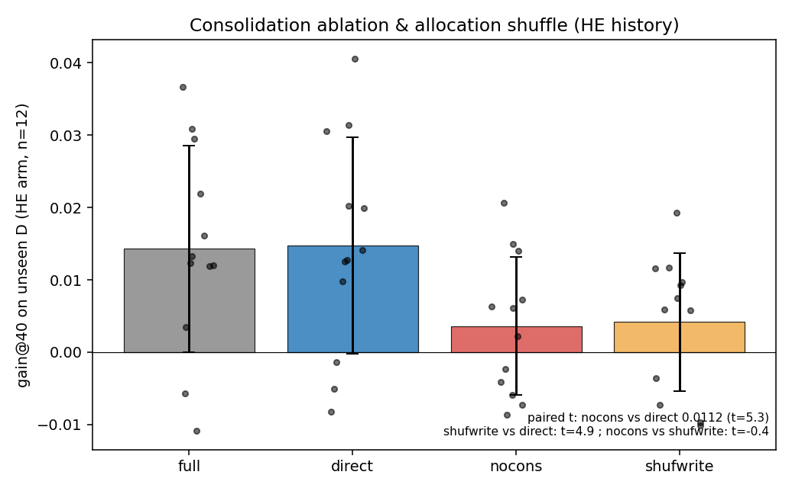

# Emergent Selective Learning in Fast/Slow Learners

**Allocation-level selectivity of consolidation, without any selection objective**

**Yang Liu** · Draft v0.4 (emergent-selective-learning thesis) — workshop/arXiv

---

## Abstract

Selective learning—retaining some changes while discarding others—is usually treated as something an algorithm must explicitly implement (loss weighting, parameter gates, per-item replay). We ask whether it can instead *emerge* from an unselective learning rule, and whether the emergent selectivity is functionally real. We study a minimal "fast/slow" learner on a fixed Transformer backbone: a fast weight `W_fast` integrates the learner's own gradient history (Adam-shaped, leaky), and at task boundaries an *unselective* rule copies a scaled `W_fast` into the slow weights at a uniform scalar coefficient—no per-parameter gate, no success signal, no alignment objective. On a 6.59M Chinese character GPT with two curriculum histories (easy→hard vs hard→easy) probed on a never-seen domain, we find: (1) history-dependent future adaptation is causally tied to the fast-weight trace (swap control, n=12); (2) the mechanism that transfers part of that trace into slow weights is the *direct* fast→slow write, not the architecture's explicitly-designed success-gated eligibility trace `Q`, which is numerically (~0.4% of write energy) and causally inert; and (3) the direct write's **coordinate allocation is functionally necessary**: keeping every write's energy identical but randomly permuting which coordinates receive it removes the entire effect (n=12, paired t≈4.9; shuffled allocation ≈ no consolidation). Because the write is `γ·W_fast` with a single scalar coefficient, "where it writes" is fully self-organized from the fast trace's own structure. We conclude that a minimal, unselective rule can exhibit *emergent, allocation-level selective learning*, that this selectivity carries causal weight for future adaptation, and that it coexists with an explicit but non-functional "selective" mechanism in the same system. We report all claims with their evidence level and provide energy-matched controls throughout.

---

## 1. Introduction

### 1.1 The question: does selectivity need to be designed?

A learner with a memory faces a choice at every update: keep or discard. Machine learning usually makes this choice explicit—regularization that penalizes change to important weights (Kirkpatrick et al., 2017; Zenke et al., 2017), replay buffers that rehearse chosen items (Robins, 1995; De Lange et al., 2021), gated plasticity that opens or closes parameters (Miconi et al., 2019; Beaulieu et al., 2020), or curricula that choose what to learn next (Poirier & Silver, 2005; Bell & Lawrence, 2022; Li & Hiratani, 2025). Neuroscience likewise postulates specialized structures for selective retention (McClelland et al., 1995; Kumaran et al., 2016).

We ask a complementary, more mechanistic question:

> If *no* selection signal is ever computed—no per-parameter gate, no success weighting, no importance measure—can selectivity still emerge, and if it does, is it functionally real or an epiphenomenon?

Selectivity is only meaningful if it has operational consequences. Our test is therefore causal: we must be able to *destroy the allocation* while keeping everything else (total write energy, magnitudes) identical, and show the outcome changes.

### 1.2 Why a fast/slow learner is the right object

Fast/slow weight architectures (Hinton & Plaut, 1987; Ba et al., 2016) are the simplest systems in which "what to consolidate" is a well-defined choice: a fast store accumulates recent changes, and a slow store must decide what to accept. Modern revivals (Schlag et al., 2021; von Oswald et al., 2023; Behrouz et al., 2025) and parameter-efficient additive methods (Houlsby et al., 2019; Hu et al., 2021; He et al., 2022) make the same conceptual split. These systems typically ship with an explicit consolidation policy. We strip the policy to its minimum—an unselective scalar-copy—and ask whether selectivity re-appears on its own.

### 1.3 The claim in one paragraph

In a minimal DLA (Section 3), two different curriculum histories produce different future adaptation on a never-seen domain, and this effect is carried by the fast-weight trace `W_fast` (Section 5.1). Consolidation into the slow store happens through two pathways: a *designed* one (a success-gated eligibility trace `Q`) and an *unselective* one (direct copy of `W_fast`). The designed pathway is inert; the unselective one carries the effect (Section 5.2). Critically, the unselective pathway is *selective in its allocation*: where it writes is dictated by the self-organized structure of `W_fast`, and destroying that allocation (energy-matched within-matrix shuffle) removes the effect (Section 5.3, n=12, paired t≈4.9). We call this **emergent selective learning**, and we are careful to define its level (allocation of writes, not experience-level or success-gated selection).

---

### 1.4 This is built on—not separate from—our prior fast/slow results

The learner we use is not new to this paper, and we deliberately build on the fast/slow results established earlier in the project rather than re-deriving them:
- **Fast/slow separation protects consolidated memory**: in the same protocol, DLA matches a tuned AdamW on new-domain adaptation while slow-memory forgetting is ≈0 (−0.4%), i.e. the fast/slow split does not trade memory for plasticity.
- **`W_fast` is a causal carrier of history-dependent future adaptation**: replacing a hard→easy learner's fast weights with an easy→hard learner's degrades future adaptation on a never-seen domain (n=12, norm/shuffle/module controls, direction replicated on a second backbone).
- **Rule parameters `φ` and the success-gated eligibility trace `Q` do not carry that effect**; and standard continual learners (AdamW, replay, EWC) in the same curriculum protocol are also history-sensitive, so history sensitivity is not unique to DLA—DLA is most robust after a difficult history.

These earlier findings are what make `W_fast`, `Q` and the slow store a *causally instrumented* setting rather than a toy: the question below—whether selectivity can emerge with no selection objective—is asked about states whose causal roles are already mapped.


## 2. Related work (positioning)

- **Selectivity by design.** Continual-learning methods select what to protect or replay (Kirkpatrick et al., 2017; Zenke et al., 2017; Robins, 1995; De Lange et al., 2021); plasticity methods gate learning per parameter, often meta-learned (Miconi et al., 2019; Beaulieu et al., 2020); plasticity-loss research shows unmaintained plasticity degrades (Dohare et al., 2024; Lyle et al., 2022; Nikishin et al., 2022). All of these *inject* a selection signal. Our contribution is complementary: we hold selection absent and test whether it emerges with causal force.
- **Task/curriculum ordering** changes continual-learning outcomes and consolidation of seen tasks (Bell & Lawrence, 2022; Li & Hiratani, 2025; Poirier & Silver, 2005; Wang et al., 2022). We measure a related but distinct object: ordering's effect on *future adaptation to a never-seen domain*, and on the allocation of that effect within the learner.
- **Fast/slow and CLS.** Complementary learning systems motivate fast/slow stores and consolidation (McClelland et al., 1995; Kumaran et al., 2016); fast-weight models (Hinton & Plaut, 1987; Ba et al., 2016) and their modern linear-attention / in-context-learning / neural-memory relatives (Schlag et al., 2021; von Oswald et al., 2023; Behrouz et al., 2025) provide the architecture family; additive PEFT (Houlsby et al., 2019; Hu et al., 2021; He et al., 2022) provides the frozen-base + additive form. Prior work uses these for memory or efficiency; we use the minimal form to test *whether selection objectives are even necessary for selective behavior*.
- **Continual learning & parameter-efficient fine-tuning as the applied setting.** In continual learning the crux is precisely *what to protect, replay or select* (baselines AdamW / replay / EWC in §4 use this literature's toolbox; Kirkpatrick et al., 2017; Zenke et al., 2017; Robins, 1995; De Lange et al., 2021). Additive frozen-base methods—adapters and LoRA (Houlsby et al., 2019; Hu et al., 2021), in their unified view (He et al., 2022)—are the practical family whose update form matches our `W_eff = W_slow + …·W_fast`, and they are exactly the setting where *where an additive update is written* could matter. Our question transfers directly: if allocation-level selectivity emerges without a selection signal here, the same question should be asked of these systems rather than assuming selection must be added.
- **Meta-learning & meta-plasticity** learn rules over episodes (Andrychowicz et al., 2016; Beaulieu et al., 2020); here the rule is fixed and unselective, and we ask what the *same* individual's dynamics alone produce.

---

## 3. System and definitions

### 3.1 The learner (minimal DLA)

We keep a standard Transformer backbone unchanged. Every wrapped weight matrix carries state:

```
W_eff  = W_slow + softplus(P) * W_fast
```

Wake step (per batch): backprop gives `g = dL/dW_eff`; Adam moments `m,v` are updated; the fast trace moves by

```
dw     = -eta_fast * softplus(P) * adam - fast_decay * W_fast
W_fast += dw
```

`W_fast` is therefore a *leaky integrator* (decay 0.02/step ⇒ ≈50-step horizon ≈ one curriculum stage) of the learner's own Adam-shaped gradient history. `P` is a per-parameter positive scale updated by a progress×relevance rule. A designed consolidation trace is also maintained: `Q ← (1−α)Q + α·(dw·success)`, where `success` is a **single global scalar** derived from loss EMA—so the designed "selection" applies one coefficient to every parameter (this is deliberate; Section 3.3 formalizes why it cannot select).

Sleep (task boundary): two write pathways into `W_slow`:

```
W_slow += beta * Q + gamma * W_fast     # designed (Q) + unselective direct copy
W_fast *= 0.5 ; Q *= 0.7 ; reset moments
```

The second term is the **unselective pathway**: every coordinate is copied with the same scalar `gamma`. No objective, no gate, no importance weight—only `W_fast`'s own structure decides, per coordinate, how much is written (the increment at coordinate *i* is `gamma·W_fast_i`).

### 3.2 Defining "selectivity" precisely (three levels)

| level | definition | present in our system by design? |
|---|---|---|
| step/global | one scalar decides keep-vs-discard for the whole update | yes (`success`) |
| parameter | different coefficients per parameter based on a per-parameter signal | no |
| subspace | selection along learned/structured directions | no |
| **allocation** | an unselective coefficient, but the *magnitude/sign per coordinate* of what is written varies by coordinate | yes (emergent) |

Our paper's core construct is **allocation-level selectivity**: identical total energy and identical rule, but different coordinates receive different amounts because the source (`W_fast`) is structured. Whether this allocation *matters* is an empirical, causal question—answered by destroying it (energy-matched shuffle) while changing nothing else.

### 3.3 Protocol and measurement

- Two histories on the same three curriculum domains (Wikipedia / SFT-QA / science Wikipedia) in opposite orders: easy→hard (EH) and hard→easy (HE).
- Probe on a never-seen science slice D (40 steps, identical data/rule/budget/eval).
- Metrics: gain@40 (relative ppl improvement), LE_D, T80. All causal/ablation claims use **within-seed, within-arm paired contrasts** (the raw EH/HE gap is seed-noisy).
- Controls: cross-injection of state components; norm-matched / shuffled / module-localized swaps; consolidation ablations (Q-only / direct-only / none); and the energy-matched **allocation shuffle** (per-matrix random permutation of each sleep's `gamma·W_fast` increment).
- Every claim is tagged by evidence level (causal / controlled / correlational / negative). No pre-registration; n=10→n=12 transparent; no seed selection; no hyperparameter tuning for effect size.

Backbone: 6.59M Chinese character GPT (6 layers, 8 heads, 256 dim, vocab 7280) pretrained on Chinese Wikipedia. Second setting (replication in direction only): 10.65M Shakespeare char GPT, n=2.

---

## 4. Results

### 4.1 History lives in the fast trace (carrier, causal)

Replacing a hard→easy learner's `W_fast` with an easy→hard learner's significantly degrades future adaptation on D: paired gain@40 Δ≈−0.019, 95% CI [−0.033,−0.005], sign p=0.019 (10/12 negative, n=12). Norm-matching does not rescue it (d≈−0.90), within-matrix shuffling does not remove it (d≈−1.25), and module-localized swaps implicate MLP (d≈−1.05) and attention (d≈−1.06) more than embedding (d≈−0.87). The direction replicates on the Shakespeare backbone (n=2). Slow weights, plasticity and rule parameters transfer little alone (component decomposition). *Level: causal (single small backbone, n=12, controls + partial replication).*

### 4.2 The directional trace is self-organized (no alignment objective exists)

A static code audit of the full wake/sleep/meta path confirms there is **no alignment operator anywhere** (no cosine/dot/objective between gradients and a history direction); directional content can only arise from `W_fast`'s leaky integration of Adam-shaped gradients. Empirically, the per-seed alignment `cos(g0, ΔW_fast)` between the D-gradient and the same seed's history contrast predicts HE adaptation: r=0.87 (permutation p≈0.000), leave-one-seed-out r∈[0.81,0.91], survives FDR (q≈0.003), survives norm-confound controls (partial r≈0.77), and module-localizes to MLP/attention—the same modules implicated causally in §4.1. *Level: correlational, consistent with emergence; no direction-manipulation experiment.*

### 4.3 Of two consolidation pathways, only the unselective one works

Measured on saved bodies: `‖Q‖ ≈ 0.002` vs `‖W_fast‖ ≈ 3.6`; the designed `Q` write is ≈0.4% of the direct write. Consolidation ablation on the HE arm (n=12, gain@40):

| variant | mean | paired t vs full | paired t vs direct |
|---|---|---|---|
| full (archive) | +0.0143 | — | — |
| direct (γ·W_fast only) | +0.0148 | +0.59 | — |
| nocons (no write) | +0.0036 | **−5.53** | **+5.30** |
| qonly (β·Q only; n=4) | +0.0094 | ≈ nocons | ≈ nocons |

`direct ≈ full`; removing consolidation drops the HE arm; the designed success-gated `Q` pathway (which is the only "selective" mechanism in the code, and is global-scalar by construction) adds nothing on top of no-consolidation. *Level: causal (n=12; n=4 for qonly).*

### 4.4 The allocation of the unselective write is functionally necessary — emergent selective learning

Energy-matched allocation shuffle (`shufwrite`): identical to `direct` except each sleep's `gamma·W_fast` increment is randomly permuted *within each matrix* before being added to `W_slow`. Total energy, magnitudes, rule and coefficients are identical; only *which coordinates* receive the write is destroyed.

HE arm, n=12: `shufwrite` mean +0.0042 vs `direct` +0.0148 → paired **t=4.86**; `shufwrite ≈ nocons` (t=−0.38) ≪ `direct` (t=4.86); `direct ≈ full` (t=0.59).



Interpretation: the write rule is scalar-uniform and unselective *by rule*, yet its effect depends entirely on where the self-organized fast trace points it. The system therefore performs **allocation-level selection with no selection objective** — and the selection is not decorative: destroying it removes the effect. *Level: causal (n=12, single setting).*

### 4.5 What does not happen (negative results, kept for honesty)

- The EH arm shows no such effect in any variant (all ≈ 0); the phenomenon is specific to the history/arm that carries the adaptation advantage.
- The designed "selective" mechanism (`Q`, `success`) is numerically and causally inert (§4.3) — an explicit design coexisting with, but not causing, the emergent behavior.
- More experience does not make learning faster: matched-difficulty p=0.17, cross-domain 20-seed p=0.82, physics near-transfer d=−0.17.
- Macroscopic state geometry does not separate histories (norm/cosine at same-history cross-seed noise level; PCA PC1 ≈ 20% variance).

---

## 5. Discussion

**What we mean by "emergent selective learning".** Not "the learner chooses experiences" and not "the learner computes importance". Rather: a scalar-uniform consolidation rule, applied to a structured fast trace, produces per-coordinate differential retention that is *causally required* for the history effect. Selectivity here is a property of the interaction between an unselective rule and a self-organized state, measurable only through interventions that destroy allocation (energy-matched shuffle).

**What the finding does and does not imply for design.** If allocation-selectivity emerges for free in minimal fast/slow learners, then "selectivity" need not be an added mechanism — and adding a *global* scalar gate (like `success`) does not create it. Obtaining *parameter-level or experience-level* selectivity would require genuinely new per-parameter/per-item signals and a channel with the same causal weight as the direct write (which currently dwarfs `Q` by ~250×). This is directly relevant to plasticity-maintenance work (Dohare et al., 2024; Lyle et al., 2022; Nikishin et al., 2022) and to the design of "growing" learners.

**Limits.** One 6.59M backbone (n=12); raw EH/HE gap is seed-noisy (strong claims are within-seed paired); the directional-alignment result is correlational; retention of earlier-task memory is not measured in the same protocol (probes never sleep); qonly was run at n=4; second-setting replication is n=2 and directional only.

**Statement-level summary.**

| Claim | In code by design? | Observed | Causal evidence | Status |
|---|---|---|---|---|
| History effect localized to `W_fast` | — | yes | swap, n=12, controls | established |
| Explicit alignment operator | no | — | — | absent |
| Directional trace (predictive, module-aligned) | emergent | r=0.87 | correlational only | emergent character |
| Designed selection via success-gated `Q` | global scalar only | Q≈0.002; qonly≈nocons | inert | refuted here |
| Direct fast→slow write carries the effect | yes (unselective scalar) | yes | n=12, t≈5.3 | established |
| **Allocation of the write is necessary** | emergent from `W_fast` | yes | n=12 energy-matched shuffle, t≈4.9 | **established (core)** |
| More experience → faster learning | — | null | — | not supported |

---

## 6. Conclusion

Selectivity can emerge where none is designed. In a minimal fast/slow learner with no alignment objective, no per-parameter gate, and a scalar-uniform consolidation rule, the learner's own gradient history shapes a fast trace whose coordinate structure determines where consolidation writes; keeping the total write energy identical but destroying that allocation removes the effect (n=12, paired t≈4.9). The architecture's explicit, globally-gated "selective" pathway plays no measurable role. The lesson is twofold: emergent, allocation-level selective learning is real and causally potent in this setting; and designers should not assume that adding a selection *signal* (especially a global one) is what creates selective behavior—or that selection needs to be added at all.

---

## Reproducibility

Code: https://github.com/JayCRL/DLA (paper + audit tooling under `analysis/wfast_geom/`, reports under `report_output/`). Protocol, hyperparameters, per-seed data and commit hashes are recorded for every claim. Mechanism-audit runs used a parity-validated harness (Apple M2 CPU; mean |Δppl| ≈ 0.24 vs archived server runs). Scripts: `stage55e_wfast_p0.py`, `validation_p0_controls.py`, `validation_baselines.py`, `stage6/7/8`, `analysis/wfast_geom/{geom,replay,p1,p1b,p1c,p2,p4_consolidation_geom,audit_cheap,audit_b3}.py`.

---

## References

1. Andrychowicz, M., Denil, M., Gomez, S., Hoffman, M. W., Pfau, D., Schaul, T., Shillingford, B., & de Freitas, N. (2016). Learning to learn by gradient descent by gradient descent. *NeurIPS*.
2. Ba, J., Hinton, G. E., Mnih, V., Leibo, J. Z., & Ionescu, C. (2016). Using fast weights to attend to the recent past. *NeurIPS*.
3. Beaulieu, S., Frantar, L., Mironov, E., Chen, Y., & Savarese, S. (2020). Learning to continually learn. *ECAI*.
4. Behrouz, A., Zhong, P., & Mirrokni, V. (2025). Titans: Learning to memorize at test time. *arXiv:2501.00663*.
5. Bell, S. J., & Lawrence, N. D. (2022). The effect of task ordering in continual learning. *arXiv:2205.13323*.
6. De Lange, M., Aljundi, R., Masana, M., Parisot, S., Jia, X., Leonardis, A., Slabaugh, G., & Tuytelaars, T. (2021). A continual learning survey: Defying forgetting in classification tasks. *IEEE TPAMI*, 43(10), 3366–3385.
7. Dohare, S., Hernandez-Garcia, J. F., Lan, Q., Rahman, P., Mahmood, A. R., & Sutton, R. S. (2024). Loss of plasticity in deep continual learning. *Nature*, 632(8026), 768–774.
8. He, J., Zhou, C., Ma, X., Berg-Kirkpatrick, T., & Neubig, G. (2022). Towards a unified view of parameter-efficient transfer learning. *ICLR*.
9. Hinton, G. E., & Plaut, D. C. (1987). Using fast weights to deblur old memories. *CogSci*.
10. Houlsby, N., Giurgiu, A., Jastrzebski, S., Morrone, B., de Laroussilhe, Q., Gesmundo, A., Attariyan, M., & Gelly, S. (2019). Parameter-efficient transfer learning for NLP. *ICML*, PMLR 97, 2790–2799.
11. Hu, E. J., Shen, Y., Wallis, P., Allen-Zhu, Z., Li, Y., Wang, S., Wang, L., & Chen, W. (2021). LoRA: Low-rank adaptation of large language models. *arXiv:2106.09685* (ICLR 2022).
12. Kirkpatrick, J., Pascanu, R., Rabinowitz, N., Veness, J., Desjardins, G., Rusu, A. A., Milan, K., Quan, J., Ramalho, T., Grabska-Barwinska, A., Hassabis, D., Clopath, C., Kumaran, D., & Hadsell, R. (2017). Overcoming catastrophic forgetting in neural networks. *PNAS*, 114(13), 3521–3526.
13. Kumaran, D., Hassabis, D., & McClelland, J. L. (2016). What learning systems do intelligent agents need? Complementary learning systems theory updated. *Trends in Cognitive Sciences*, 20(7), 512–534.
14. Li, Z., & Hiratani, N. (2025). Optimal task order for continual learning of multiple tasks. *ICML*. arXiv:2502.03350.
15. Lyle, C., Rowland, M., & Dabney, W. (2022). Understanding and preventing capacity loss in reinforcement learning. *ICML*.
16. McClelland, J. L., McNaughton, B. L., & O'Reilly, R. C. (1995). Why there are complementary learning systems in the hippocampus and neocortex. *Psychological Review*, 102(3), 419–457.
17. Miconi, T., Clune, J., & Stanley, K. O. (2019). Differentiable plasticity: Training plastic neural networks with backpropagation. *ICLR*.
18. Nikishin, E., Schwarzer, M., D'Oro, P., Bacon, P.-L., & Courville, A. (2022). The primacy bias in deep reinforcement learning. *ICML*.
19. Poirier, R., & Silver, D. L. (2005). Effect of curriculum on the consolidation of neural network task knowledge. *IJCNN*.
20. Qi, B., Li, P., Li, F., Gao, J., Zhang, K., & Zhou, B. (2024). Online DPO: Online direct preference optimization with fast-slow chasing. *arXiv:2406.05534*.
21. Robins, A. (1995). Catastrophic forgetting, rehearsal and pseudorehearsal. *Connection Science*, 7(2), 123–146.
22. Schlag, I., Irie, K., & Schmidhuber, J. (2021). Linear transformers are secretly fast weight programmers. *ICML*, PMLR 139, 9355–9366.
23. von Oswald, J., Niklasson, E., Randazzo, E., Sacramento, J., Mordvintsev, A., Zhmoginov, A., & Vladymyrov, M. (2023). Transformers learn in-context by gradient descent. *ICML*, PMLR 202, 35151–35174.
24. Wang, X., Chen, Y., & Zhu, W. (2022). A survey on curriculum learning. *IEEE TPAMI*, 44(9), 4555–4576.
25. Zenke, F., Poole, B., & Ganguli, S. (2017). Continual learning through synaptic intelligence. *ICML*.
