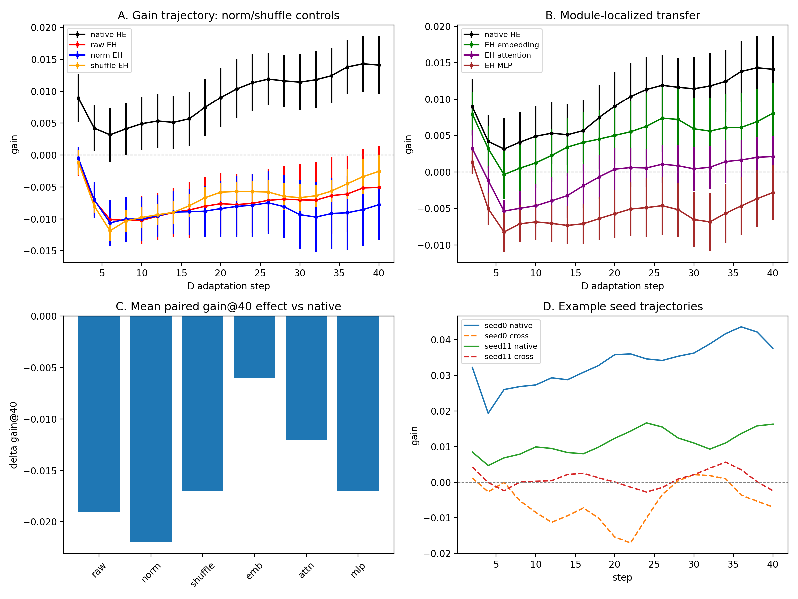

# Developmental Learning Architecture: Learning History, Fast-Weight Traces, and Future Adaptation

**First author: Yang Liu**

**Draft v0.2 (validation-stage) — workshop/arXiv**

---

## Abstract

We study whether a learner's *prior learning history* changes how it will learn in the future, and which internal state carries this effect. Our Developmental Learning Architecture (DLA) keeps standard MLP/Transformer backbones unchanged but augments every weight with per-parameter fast weights, plasticity, and sleep consolidation, forming a fast/slow learner state. Using a 6.59M Chinese character-level GPT we show: (i) DLA matches tuned AdamW on new-domain adaptation while keeping consolidated slow memory essentially immune to forgetting; (ii) different curriculum histories (easy→hard vs hard→easy) lead to different future adaptation on an unseen domain; (iii) this history-dependent future adaptation is causally tied to the fast-weight state `W_fast` — replacing the hard→easy learner's fast weights with those from an easy→hard learner significantly degrades future adaptation (n=12, gain@40 difference −0.019, bootstrap CI excludes zero, Cohen's d ≈ −0.7); (iv) norm-matching and within-matrix shuffling do not remove the effect, so it is not explained by global magnitude or by a simple random-parameter control; (v) localization is suggestive of MLP and attention contributions; (vi) standard baselines (AdamW, replay, EWC) also show history sensitivity, but DLA is the most robust after a difficult history; and (vii) the destructive `W_fast` effect replicates on a second Shakespeare character-level backbone. We do **not** find evidence that more experience monotonically accelerates learning: controlled longitudinal experiments across same-domain, cross-domain, and physics-near-transfer settings consistently fail to show a positive trend. The paper therefore proposes a precise framing: developmental change does not equal universally faster learning; rather, learning history leaves a persistent, partially localizable trace in transient learner state, with `W_fast` providing a causal component of history-dependent future adaptation.

---

## 1 Introduction

Standard neural training assumes the learner is a fixed function plus an external optimizer. This paper asks a more developmental question: *can the way a model learns change as a result of what it has learned?* We build a minimal architecture, DLA, in which each weight matrix is augmented by fast weights, plasticity, and sleep consolidation. The Transformer backbone itself is not modified.

Our empirical questions are:

- Does learning history change future adaptation on a new task?
- Which internal state carries that effect?
- Does the effect manifest as *faster learning* (monotonic self-improvement)?

We find support for the first two, and a clear negative result for the third.

---

## 2 Related Work

- Fast weights and fast/slow memory (Hinton & Plaut, 1987; Ba et al., 2016; Schmidhuber, 1992).
- Stability–plasticity dilemma and synaptic intelligence (Abraham & Robins, 2005; Zenke et al., 2017).
- Meta-learning and learned plasticity (Andrychowicz et al., 2016; Miconi et al., 2019; Beaulieu et al., 2020).
- Continual learning baselines used here: Elastic Weight Consolidation (Kirkpatrick et al., 2017) and experience replay (Robins, 1995).
- This work is distinct: we do not primarily propose a better continual-learning algorithm; we ask a mechanistic question about whether and where "development" lives in the learner state.

---

## 3 Method

### 3.1 DLA state

For every 2D weight matrix (or embedding) we maintain:

- `W_slow`: consolidated long-term knowledge;
- `W_fast`: current learning trace;
- `P`: per-parameter plasticity gate;
- `Q`: slow-eligibility trace.

Effective weights:

```
W_eff = W_slow + softplus(P) * W_fast
```

The online (wake) update uses Adam-style moments on `W_fast`, modulated by `softplus(P)`, with `P` updated by a meta-plasticity rule. At task boundaries (sleep), `W_slow` is updated from `Q` and a small direct transfer of `W_fast`, and `W_fast` is decayed.

### 3.2 Histories and probe task

To create two different developmental histories we use three curriculum domains:

- easy→hard (EH): domains ordered from low birth perplexity to high;
- hard→easy (HE): the reverse order.

After experiencing all three tasks, the same model (stateful DLA) is probed on an **unseen domain D** under a fixed adaptation budget. We measure test perplexity trajectories and report `gain@40` (relative PPL reduction after 40 steps), normalized learning efficiency, and T80.

---

## 4 Experimental Setup

Primary backbone:
- 6.59M Chinese character GPT (6 layers, 8 heads, 256 dim, vocab 7280), pretrained on Chinese Wikipedia.
- Curriculum domains: Wikipedia, SFT-style QA, science Wikipedia.
- Unseen D: science slice not used in curriculum.

Second setting:
- ~10.65M Shakespeare character GPT (6 layers, 6 heads, 384 dim, vocab 65).

Baselines:
- AdamW; AdamW + replay; EWC, all using the same histories and D probe where applicable.

Metrics:
- gain@40; LE_D; T80; initial PPL; per-task normalized loss slope; paired contrasts with bootstrap CI and sign tests.

---

## 5 Results

### 5.1 Fast/slow separation protects consolidated memory

Stage 4 formal (5 seeds): DLA matches tuned AdamW on adaptation to a new domain (gain +14.0% vs +13.0%) while consolidated slow-memory forgetting is ≈0 (−0.4%±0.2). This shows the fast/slow separation is a usable memory mechanism.

### 5.2 Learning history changes future adaptation

Across several settings, a hard→easy history leads to better future adaptation on unseen D than easy→hard. This history effect is not unique to DLA; standard learners also show it (Section 5.6), but DLA is the most robust after a difficult history.

### 5.3 Scalar learning-rule parameters are not a stable carrier

Body × φ cross-injection (Stage 5.5c): replacing the 9-dimensional tempo vector between histories changes future adaptation much less than replacing the body state. We therefore say φ is not a stable/dominant carrier in this setting, not that φ has no effect.

### 5.4 W_fast is a causal component

The core causal result (Stage 5.5e P0, n=12):

| condition | mean gain@40 |
|---|---|
| HE/HE | +0.014 |
| HE + EH W_fast | −0.005 |

Paired contrast HE→raw EH: mean −0.019, 95% CI [−0.033, −0.005], Cohen's d ≈ −0.71, sign p=0.019 (10/12 negative). Initial PPL differences are small; the effect appears in the adaptation trajectory.

### 5.5 Norm, shuffle and module controls

n=12 gain@40 paired contrasts (vs HE/HE):

| control | mean Δ gain@40 | 95% CI | d |
|---|---|---|---|
| raw EH W_fast | −0.019 | [−0.034, −0.005] | −0.71 |
| norm-matched EH W_fast | −0.022 | [−0.034, −0.009] | −0.90 |
| shuffled EH W_fast | −0.017 | [−0.023, −0.009] | −1.25 |
| EH embedding W_fast | −0.006 | [−0.009, −0.002] | −0.87 |
| EH attention W_fast | −0.012 | [−0.018, −0.006] | −1.06 |
| EH MLP W_fast | −0.017 | [−0.025, −0.008] | −1.05 |

Norm-matching does not rescue the effect; global magnitude is not the explanation. Shuffle also does not rescue the effect, so a simple random-parameter control is not sufficient. Module localization is suggestive of MLP and attention contributions; embedding contributes less.




### 5.6 Fair baselines

n=5 (LE_D means):

| method | EH | HE | HE−EH |
|---|---|---|---|
| AdamW | 0.339 | 0.675 | +0.336 |
| AdamW + replay | 0.375 | 0.961 | +0.586 |
| EWC | 0.292 | 0.895 | +0.603 |
| DLA | 0.517 | 0.709 | +0.192 |

DLA is the most robust after an EH (easy→hard) history. Standard learners achieve higher HE performance but suffer larger EH degradation.

### 5.7 Second-setting replication

Shakespeare character GPT, 2 seeds:

| seed | HE/HE gain40 | HE + EH W_fast |
|---|---|---|
| 0 | +0.052 | +0.004 |
| 1 | +0.042 | −0.001 |

The destructive W_fast effect replicates in direction on a different backbone/corpus. Small n; treated as exploratory support.

### 5.8 Negative result: development ≠ monotonically faster learning

We directly tested whether more experience makes later tasks easier to learn:

- Stage 5 (difficulty-normalized curriculum): LE roughly flat.
- Stage 6 (matched-difficulty science slices): 7/10 seeds directional, p=0.17.
- Stage 7 (cross-domain, 10 tasks, 20 seeds): regression slope ≈0, p=0.82.
- Stage 8 (physics near-transfer, 20 seeds): d=−0.17.

We therefore do not claim that developmental learning produces universally faster learning. The evidence supports a more specific statement: learning history changes the learner's state and future adaptation, and this change is not simply "getting faster."

---

## 6 Discussion

- **What is safe to claim.** DLA separates fast adaptation from slow memory preservation. Learning history changes future adaptation. The effect is substantially body-mediated, with `W_fast` as a causal component. Norm and shuffle controls do not remove the effect. The effect is not monotonically faster learning.
- **What remains suggestive.** Exact localization to one module; the degree to which `W_fast` encodes content vs dynamics; generalizability beyond two small backbones.
- **What must not be claimed.** That `W_fast` is the only carrier; that φ has no effect; that development means universally faster learning; that sleep consolidation strongly writes knowledge into `W_slow`; that results at 6–10M parameters transfer to large language models.
- **Reviewer-facing limitations.** No pre-registration (we report n=10→n=12 extension transparently). Baselines n=5. Second setting n=2. One language plus Shakespeare English corpus only.

---

## 7 Conclusion

We provide evidence for the claim that a learner is not fully characterized by what it currently knows: its prior learning history can alter how it subsequently learns. The evidence points to a persistent, partially localizable trace in transient learner state, with `W_fast` providing a causal component of history-dependent future adaptation. We do not find evidence that this developmental effect simply manifests as faster learning.

---

## Reproducibility

- Code: https://github.com/JayCRL/DLA
- Experiment tables and result JSONs: see `docs/experiments.md`, `paper/overnight_report.md`, `paper/validation_audit.md`, `results/`.
- Scripts:
  - `stage4_formal.py`, `stage5_progressive_curriculum.py`
  - `stage55e_wfast_p0.py`, `validation_p0_controls.py`, `validation_baselines.py`, `validation_second_setting.py`
  - `stage6_longitudinal.py`, `stage7_cross_domain.py`, `stage8_physics.py`
- Figures: see `paper/figures/`.

---

## References (to be completed)

- Hinton, G., & Plaut, D. (1987). Using fast weights to deblur old memories.
- Ba, J., Hinton, G., Mnih, V., Leibo, J., & Ionescu, C. (2016). Using fast weights to attend to the recent past.
- Zenke, F., Poole, B., & Ganguli, S. (2017). Continual learning through synaptic intelligence.
- Kirkpatrick, J., et al. (2017). Overcoming catastrophic forgetting in neural networks.
- Andrychowicz, M., et al. (2016). Learning to learn by gradient descent by gradient descent.
- Miconi, T., Clune, J., & Stanley, K. (2019). Differentiable plasticity.
- Beaulieu, S., et al. (2020). Learning to continually learn.
- Robins, A. (1995). Catastrophic forgetting, rehearsal and pseudorehearsal.
