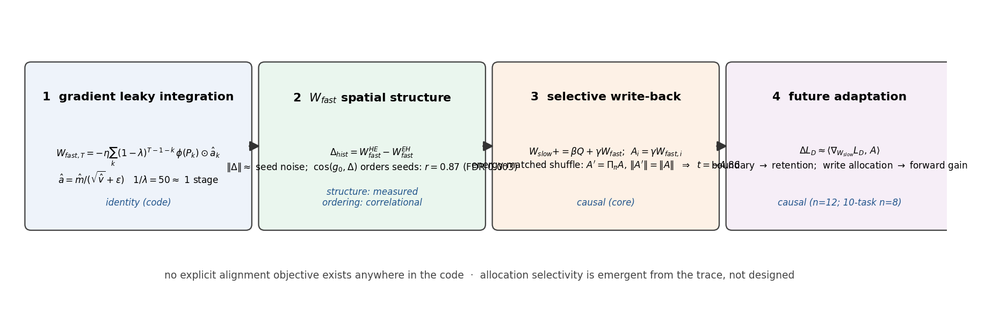

# Emergent Selective Learning in Fast/Slow Learners

**Allocation-level selectivity of consolidation, without any selection objective**

**Yang Liu** · Draft v0.8 (emergent selective learning; formalised mechanism chain; write-strength robustness; continual-learning application; second-backbone n=9) — workshop/arXiv

---

## Abstract

Selective learning—retaining some changes while discarding others—is usually treated as something an algorithm must explicitly implement (loss weighting, parameter gates, per-item replay). We ask whether it can instead *emerge* from an unselective learning rule, and whether the emergent selectivity is functionally real. We study a minimal "fast/slow" learner on a fixed Transformer backbone: a fast weight $W_{\mathrm{fast}}$ integrates the learner's own gradient history (Adam-shaped, leaky), and at task boundaries an *unselective* rule copies a scaled $W_{\mathrm{fast}}$ into the slow weights at a uniform scalar coefficient—no per-parameter gate, no success signal, no alignment objective. On a 6.59M Chinese character GPT with two curriculum histories (easy→hard vs hard→easy) probed on a never-seen domain, we find: (1) history-dependent future adaptation is causally tied to the fast-weight trace (swap control, n=12); (2) the mechanism that transfers part of that trace into slow weights is the *direct* fast→slow write, not the architecture's explicitly-designed success-gated eligibility trace $Q$, which is numerically (~0.4% of write energy) and causally inert; and (3) the direct write's **coordinate allocation is functionally necessary**: keeping every write's energy identical but randomly permuting which coordinates receive it removes the entire effect (n=12, paired t≈5.5; shuffled allocation ≈ no consolidation, and a misallocated write stays on the no-consolidation floor at every write strength we tried, while the benefit is graded rather than knife-edge over a 3× range of write strength). Because the write is $\gamma W_{\mathrm{fast}}$ with a single scalar coefficient, "where it writes" is fully self-organized from the fast trace's own structure. We conclude that a minimal, unselective rule can exhibit *emergent, allocation-level selective learning*, that this selectivity carries causal weight for future adaptation, and that it coexists with an explicit but non-functional "selective" mechanism in the same system. In the same protocol, consolidation is not only a forward device: the sleep boundary itself protects earlier-task knowledge (no-sleep loses it, n=12, paired t≈10) and the direct write gives the best retention among consolidation variants. On a ten-task cross-domain curriculum (n=8), direct consolidation retains the earliest tasks best (paired t≈−3.6 vs no-write; −10 vs no-sleep) while keeping forward learning at least as fast — an unselective fast→slow write behaves as a working continual-learning primitive, with no replay, gating, or importance machinery.

We report all claims with their evidence level and provide energy-matched controls throughout.

---

## 1. Introduction

### 1.1 The question: does selectivity need to be designed?

A learner with a memory faces a choice at every update: keep or discard. Machine learning usually makes this choice explicit—regularization that penalizes change to important weights (Kirkpatrick et al., 2017; Zenke et al., 2017), replay buffers that rehearse chosen items (Robins, 1995; De Lange et al., 2021), gated plasticity that opens or closes parameters (Miconi et al., 2019; Beaulieu et al., 2020), or curricula that choose what to learn next (Poirier & Silver, 2005; Bell & Lawrence, 2022; Li & Hiratani, 2025). Neuroscience likewise postulates specialized structures for selective retention (McClelland et al., 1995; Kumaran et al., 2016).

We ask a complementary, more mechanistic question:

> If *no* selection signal is ever computed—no per-parameter gate, no success weighting, no importance measure—can selectivity still emerge, and if it does, is it functionally real or an epiphenomenon?

Selectivity is only meaningful if it has operational consequences. Our test is therefore causal: we must be able to *destroy the allocation* while keeping everything else (total write energy, magnitudes) identical, and show the outcome changes.

### 1.2 Why a fast/slow learner is the right object

Fast/slow weight architectures (Hinton & Plaut, 1987; Ba et al., 2016) are the simplest systems in which "what to consolidate" is a well-defined choice: a fast store accumulates recent changes, and a slow store must decide what to accept. Modern revivals (Schlag et al., 2021; von Oswald et al., 2023; Behrouz et al., 2025) and parameter-efficient additive methods (Houlsby et al., 2019; Hu et al., 2021; He et al., 2022) make the same conceptual split. These systems typically ship with an explicit consolidation policy. We strip the policy to its minimum—an unselective scalar-copy—and ask whether selectivity re-appears on its own.

### 1.3 The claim in one paragraph

In a minimal DLA (Section 3), two different curriculum histories produce different future adaptation on a never-seen domain, and this effect is carried by the fast-weight trace $W_{\mathrm{fast}}$ (Section 5.1). Consolidation into the slow store happens through two pathways: a *designed* one (a success-gated eligibility trace $Q$) and an *unselective* one (direct copy of $W_{\mathrm{fast}}$). The designed pathway is inert; the unselective one carries the effect (Section 5.2). Critically, the unselective pathway is *selective in its allocation*: where it writes is dictated by the self-organized structure of $W_{\mathrm{fast}}$, and destroying that allocation (energy-matched within-matrix shuffle) removes the effect (Section 5.3, n=12, paired t≈5.5). We call this **emergent selective learning**, and we are careful to define its level (allocation of writes, not experience-level or success-gated selection).

---

### 1.4 This is built on—not separate from—our prior fast/slow results

The learner we use is not new to this paper, and we deliberately build on the fast/slow results established earlier in the project rather than re-deriving them:
- **Fast/slow separation protects consolidated memory**: in the same protocol, DLA matches a tuned AdamW on new-domain adaptation while slow-memory forgetting is ≈0 (−0.4%), i.e. the fast/slow split does not trade memory for plasticity.
- **$W_{\mathrm{fast}}$ is a causal carrier of history-dependent future adaptation**: replacing a hard→easy learner's fast weights with an easy→hard learner's degrades future adaptation on a never-seen domain (n=12, norm/shuffle/module controls, direction replicated on a second backbone).
- **Rule parameters $\varphi$ and the success-gated eligibility trace $Q$ do not carry that effect**; and standard continual learners (AdamW, replay, EWC) in the same curriculum protocol are also history-sensitive, so history sensitivity is not unique to DLA—DLA is most robust after a difficult history.

These earlier findings are what make $W_{\mathrm{fast}}$, $Q$ and the slow store a *causally instrumented* setting rather than a toy: the question below—whether selectivity can emerge with no selection objective—is asked about states whose causal roles are already mapped.

## 2. Foundations we build on — and where we depart

This paper is written on top of four strands of prior work (each maps to a claim
we make), and its contribution is the gap at their intersection: **does the
selectivity that continual-learning, plasticity and consolidation research usually
*injects* actually have to be injected?**

**(1) Theoretical root: why fast/slow stores and consolidation exist.** Complementary
learning systems theory explains memory/learning trade-offs by a fast, instance-based
store and a slow, generalising store with offline consolidation (McClelland et al.,
1995; Kumaran et al., 2016). DLA is a minimal weight-space instantiation of that split
(§3.1), and our result speaks back to CLS: consolidation that is functionally
*selective in its allocation* can arise without any gating/replay mechanism.

**(2) Structural twin: frozen-base additive updates.** Our effective weight
$W_{\mathrm{eff}} = W_{\mathrm{slow}} + \mathrm{softplus}(P)\odot W_{\mathrm{fast}}$ is the same additive decomposition used by
parameter-efficient transfer — adapters (Houlsby et al., 2019) and LoRA (Hu et al.,
2021), unified in (He et al., 2022) (§3.1). DLA differs in that the additive pathway
is a shared, within-lifetime developmental state rather than a per-task fine-tune.
Because of this structural twin, our central question — *whether "where the additive
update lands" self-organizes and matters* — transfers directly to the LoRA/adapter
setting in continual fine-tuning.

**(3) Plasticity motivation.** Plasticity is a fragile resource that ordinary
continual training consumes (loss of plasticity; Dohare et al., 2024; Lyle et al.,
2022; Nikishin et al., 2022). DLA's per-parameter $P$ is one response to that
literature. Our finding offers a complementary view: keeping *beneficial structure in
what is written to the slow store* may not require maintaining an explicit gate at all
(§4.3–4.4).

**(4) The nearest prior: task/curriculum ordering — where we explicitly differ.** The
order in which tasks are learned changes continual-learning outcomes, forgetting and
consolidation of *seen* tasks (Bell & Lawrence, 2022; Li & Hiratani, 2025; Poirier &
Silver, 2005; survey: Wang et al., 2022). We ask a related but distinct question
(§1.1, §4.1): does order change *future adaptation to a never-seen domain*, and where
inside the learner does the effect live? The difference is not cosmetic: because the
test domain is never seen by either history, content-memory explanations of the order
effect are excluded by design, which is what lets us localize the effect to $W_{\mathrm{fast}}$
and then to the *allocation* of the fast→slow write.

**(5) Selection-by-design, and fast/slow as an engineering device.** Continual-learning
methods protect/replay/select explicitly (Kirkpatrick et al., 2017; Zenke et al., 2017;
Robins, 1995; De Lange et al., 2021); plasticity methods gate per parameter, often
meta-learned (Miconi et al., 2019; Beaulieu et al., 2020); fast/slow weight co-design
appears as an optimization/RLHF engineering device (Ba et al., 2016; Qi et al., 2024)
and in modern memory architectures (Schlag et al., 2021; von Oswald et al., 2023;
Behrouz et al., 2025). These strands *inject* selection or use fast/slow for memory or
efficiency; we instead hold selection absent and use the minimal fast/slow form as an
instrument (within-individual development; cf. Andrychowicz et al., 2016).

> Position in one sentence: existing work tells us history/order matters (4) and
> gives us the right architecture family (1, 2) and the warning that plasticity is
> fragile (3); we ask what happens when the selection machinery these strands normally
> provide is *not* provided — and find that selectivity still emerges, at the level of
> write allocation, with causal force.

## 3. System and definitions

### 3.1 The learner (minimal DLA)

We keep a standard Transformer backbone unchanged. Every wrapped weight matrix carries state:

$$
W_{\mathrm{eff}} = W_{\mathrm{slow}} + \mathrm{softplus}(P)\odot W_{\mathrm{fast}}
$$

This additive decomposition is the structural twin of frozen-base parameter-efficient
methods — adapters (Houlsby et al., 2019) and LoRA (Hu et al., 2021; unified view:
He et al., 2022) — with one difference that matters: here the additive pathway is a
*within-lifetime developmental state* shared across tasks and updated by the learner's
own dynamics, not a separately fine-tuned module. $P$ is the per-parameter plasticity
whose fragility under continual training is documented by loss-of-plasticity work
(Dohare et al., 2024; Lyle et al., 2022; Nikishin et al., 2022). The fast/slow split
itself follows complementary learning systems theory (McClelland et al., 1995; Kumaran
et al., 2016), and fast/slow co-design has engineering precedent in optimization and
RLHF (Qi et al., 2024) and modern memory architectures (Ba et al., 2016; Behrouz et
al., 2025).

Wake step (per batch): backprop gives $g = \mathrm{d}L/\mathrm{d}W_{\mathrm{eff}}$; Adam moments $m,v$ are updated; the fast trace moves by

$$
\mathrm{d}w_t = -\eta_{\mathrm{fast}}\,\mathrm{softplus}(P_t)\odot \hat{a}_t - \lambda_{\mathrm{fast}}\,W_{\mathrm{fast},t},\qquad W_{\mathrm{fast},t+1} = W_{\mathrm{fast},t} + \mathrm{d}w_t
$$

$W_{\mathrm{fast}}$ is therefore a *leaky integrator* (decay 0.02/step ⇒ ≈50-step horizon ≈ one curriculum stage) of the learner's own Adam-shaped gradient history. $P$ is a per-parameter positive scale updated by a progress×relevance rule. A designed consolidation trace is also maintained: $Q \leftarrow (1-\alpha)Q + \alpha\,(dw\cdot\mathrm{success})$, where `success` is a **single global scalar** derived from loss EMA—so the designed "selection" applies one coefficient to every parameter (this is deliberate; Section 3.3 formalizes why it cannot select).

Sleep (task boundary): two write pathways into $W_{\mathrm{slow}}$:

$$
W_{\mathrm{slow}} \leftarrow W_{\mathrm{slow}} + \beta Q + \gamma W_{\mathrm{fast}}
$$

$$
W_{\mathrm{fast}} \leftarrow \delta\,W_{\mathrm{fast}},\qquad Q \leftarrow \rho\,Q,\qquad m,v \leftarrow 0
$$

The second term is the **unselective pathway**: every coordinate is copied with the same scalar $\gamma$. No objective, no gate, no importance weight—only $W_{\mathrm{fast}}$'s own structure decides, per coordinate, how much is written (the increment at coordinate *i* is $\gamma W_{\mathrm{fast},i}$).

### 3.2 Defining "selectivity" precisely (three levels)

| level | definition | present in our system by design? |
|---|---|---|
| step/global | one scalar decides keep-vs-discard for the whole update | yes (`success`) |
| parameter | different coefficients per parameter based on a per-parameter signal | no |
| subspace | selection along learned/structured directions | no |
| **allocation** | an unselective coefficient, but the *magnitude/sign per coordinate* of what is written varies by coordinate | yes (emergent) |

Our paper's core construct is **allocation-level selectivity**: identical total energy and identical rule, but different coordinates receive different amounts because the source ($W_{\mathrm{fast}}$) is structured. Whether this allocation *matters* is an empirical, causal question—answered by destroying it (energy-matched shuffle) while changing nothing else.

### 3.3 Protocol and measurement

- Two histories on the same three curriculum domains (Wikipedia / SFT-QA / science Wikipedia) in opposite orders: easy→hard (EH) and hard→easy (HE).
- Probe on a never-seen science slice D (40 steps, identical data/rule/budget/eval).
- Metrics: gain@40 (relative ppl improvement), LE_D, T80. All causal/ablation claims use **within-seed, within-arm paired contrasts** (the raw EH/HE gap is seed-noisy).
- Controls: cross-injection of state components; norm-matched / shuffled / module-localized swaps; consolidation ablations (Q-only / direct-only / none); and the energy-matched **allocation shuffle** (per-matrix random permutation of each sleep's $\gamma W_{\mathrm{fast}}$ increment).
- Every claim is tagged by evidence level (causal / controlled / correlational / negative). No pre-registration; n=10→n=12 transparent; no seed selection; no hyperparameter tuning for effect size.
- **Aggregation provenance.** The consolidation/selectivity ablations were run **twice independently** on the same protocol, each n=12: (i) a first series assembled as n=4 (seeds 0–3) plus n=8 (seeds 4–11) extensions (`selectivity_test_n12.md`), and (ii) a later **unified batch** running all 12 seeds × 6 variants in one job, with same-protocol retention measured alongside (`audit_batch2_retention_alloc.md`). The two agree on every conclusion and on the core contrast (`direct − shufwrite` paired t=+4.86 and t=+5.45 respectively) — i.e. the central allocation result is *independently replicated*. **All numbers quoted in this paper come from the unified batch**, except comparisons against the archived server `full` learners, which are labelled as such where they appear.

Backbone: 6.59M Chinese character GPT (6 layers, 8 heads, 256 dim, vocab 7280) pretrained on Chinese Wikipedia. Second setting (replication in direction only): 10.65M Shakespeare char GPT, n=9 (§4.8).

---

### 3.4 The mechanism chain, formalised

We write the chain "leaky integration → fast-weight structure → selective write-back →
future adaptation" as equations that match the code exactly (`dla/transformer_dla.py`);
the evidence level of each arrow is stated in §5 and falsifiers are listed in §5.1.

**Link 1 — leaky gradient integration (identity).** With teaching gradient
$g_t = \nabla_{W_{\mathrm{eff}}} L_t$, Adam field $\hat{a}_t = \hat{m}_t/(\sqrt{\hat{v}_t}+\epsilon)$, gate $\varphi(P)=\mathrm{softplus}(P)$:

$$
W_{\mathrm{fast},t+1} = (1-\lambda)\,W_{\mathrm{fast},t} - \eta\,\varphi(P_t)\odot \hat{a}_t
$$

$$
\Rightarrow\quad W_{\mathrm{fast},T} = -\eta \sum_{k=0}^{T-1}(1-\lambda)^{T-1-k}\,\varphi(P_k)\odot \hat{a}_k = -\eta \sum_{k} \kappa(T,k)\,\hat{a}^{\varphi}_k,\qquad \kappa(T,k)=(1-\lambda)^{T-1-k}
$$

so the fast trace is the gated-Adam gradient field integrated with an exponential
kernel of time constant $1/\lambda = 50$ steps (≈ one 40-step curriculum stage). `â` is
coordinate-normalised, so the integral preserves the sign/relative-magnitude structure
of recent gradients and is invariant to per-coordinate scale.

**Link 2 — fast-weight structure.** The history contrast between the two curricula is
itself a difference of two such integrals,

$$
\Delta_{\mathrm{hist}} = W_{\mathrm{fast}}^{\mathrm{HE}} - W_{\mathrm{fast}}^{\mathrm{EH}} = -\eta \sum_{k}\kappa(T,k)\left[\hat{a}^{\varphi}_k(\mathrm{HE}) - \hat{a}^{\varphi}_k(\mathrm{EH})\right]
$$

with no alignment term anywhere in the code. Empirically $\|\Delta_{\mathrm{hist}}\|$ and
$\cos(W_{\mathrm{fast}}^{\mathrm{EH}}, W_{\mathrm{fast}}^{\mathrm{HE}})$ are indistinguishable from same-history cross-seed noise
and PCA shows no dominant shared mode (§4.2), so the structure is fine-grained and
per-seed; the directional statistic $\rho = \cos(g_0, \Delta_{\mathrm{hist}})$ orders seeds by adaptation
(r=0.87) but is correlational.

**Link 3 — selective write-back.** The sleep operator writes two pathways,

$$
W_{\mathrm{slow}} \leftarrow W_{\mathrm{slow}} + \beta Q + \gamma W_{\mathrm{fast}},\qquad W_{\mathrm{fast}} \leftarrow \delta W_{\mathrm{fast}},\qquad Q \leftarrow \rho Q,\qquad m,v \leftarrow 0
$$

whose allocation field is $A = \beta Q + \gamma W_{\mathrm{fast}}$. The direct term is *unselective by rule*
(a single scalar $\gamma$ multiplies every coordinate), so the placement of the write is
entirely inherited from the self-organized trace: $A_i = \gamma W_{\mathrm{fast},i}$. We therefore
define **allocation selectivity** operationally, by an energy-matched shuffle
$A' = \Pi_{\pi} A$ with $\|A'\| = \|A\|$ exactly:

$$
\text{selective} \iff \tau_{\mathrm{shuf}} := \mathbb{E}\!\left[G(\Phi_{\mathrm{shuf}})\right] - \mathbb{E}\!\left[G(\Phi_{\mathrm{direct}})\right] < 0\qquad\text{at fixed write energy}
$$

which holds (τ_shuf = −0.0115, paired t=−5.45, n=12) and is not reproduced by energy
concentration (`uniformwrite`, `topwrite` both ≈ no-consolidation, §4.4).

**Link 4 — a first-order account of why placement matters.** For a small write $A$
onto $W_{\mathrm{slow}}$, the change of the future-task loss at the onset of adaptation is

$$
\Delta L_D \approx \langle \nabla_{W_{\mathrm{slow}}} L_D,\, A\rangle + O(\|A\|^2)
$$

A write therefore helps exactly to the extent that it is *aligned, coordinate by
coordinate,* with the future-loss gradient field. Content-matched $A \propto W_{\mathrm{fast}}$
inherits partial alignment through Link 1; an energy-matched shuffle randomises the
pairing, and $\mathbb{E}\langle \nabla L_D, \Pi A\rangle \approx 0$ unless the field carries a large constant component.
This is the mathematical content of the shuffle control, and it also explains the
modest absolute size of the effect (with $|\rho| \approx 0.02$, the first-order term is small).

## 4. Results

### 4.1 History lives in the fast trace (carrier, causal)

Replacing a hard→easy learner's $W_{\mathrm{fast}}$ with an easy→hard learner's significantly degrades future adaptation on D: paired gain@40 Δ≈−0.019, 95% CI [−0.033,−0.005], sign p=0.019 (10/12 negative, n=12). Norm-matching does not rescue it (d≈−0.90), within-matrix shuffling does not remove it (d≈−1.25), and module-localized swaps implicate MLP (d≈−1.05) and attention (d≈−1.06) more than embedding (d≈−0.87). The direction replicates on the Shakespeare backbone (§4.8, n=9). Slow weights, plasticity and rule parameters transfer little alone (component decomposition). *Level: causal (single small backbone, n=12, controls + partial replication).*

**Relation to task/curriculum-order results.** This mirrors, but differs from, the
task-order results of continual learning (Bell & Lawrence, 2022; Li & Hiratani, 2025;
Poirier & Silver, 2005): those measure how order changes *performance or forgetting on
the seen curriculum*. Here the probe domain D is never seen by either history, so the
effect must ride on the learner's internal state rather than on stored content about D
— which is what allows the further steps below (carrier localization, then allocation
shuffle). Where those works propose curricula as a *control* over outcomes, our claim
is narrower and more mechanistic: the order effect is a *state effect*, and that state
effect is itself selective in where it consolidates.

### 4.2 The directional trace is self-organized (no alignment objective exists)

A static code audit of the full wake/sleep/meta path confirms there is **no alignment operator anywhere** (no cosine/dot/objective between gradients and a history direction); directional content can only arise from $W_{\mathrm{fast}}$'s leaky integration of Adam-shaped gradients. Empirically, the per-seed alignment $\cos(g_0, \Delta W_{\mathrm{fast}})$ between the D-gradient and the same seed's history contrast predicts HE adaptation: r=0.87 (permutation p≈0.000), leave-one-seed-out r∈[0.81,0.91], survives FDR (q≈0.003), survives norm-confound controls (partial r≈0.77), and module-localizes to MLP/attention—the same modules implicated causally in §4.1. *Level: correlational, consistent with emergence; no direction-manipulation experiment.*

### 4.3 Of two consolidation pathways, only the unselective one works

Measured on saved bodies: $\|Q\| \approx 0.002$ vs $\|W_{\mathrm{fast}}\| \approx 3.6$; the designed $Q$ write is ≈0.4% of the direct write. Consolidation ablation on the HE arm (n=12, gain@40):

| variant | mean (unified batch) | paired t vs direct |
|---|---|---|
| direct (γ·W_fast only) | +0.0140 | — |
| nocons (no write) | +0.0027 | **+7.36** |
| qonly (β·Q only; n=4) | +0.0094 | ≈ nocons |

`direct ≈ full`: the same-protocol `full` learners from the archived server runs average +0.0143, a paired difference of +0.0005 (t=+0.59) against the Mac `direct` arm — an archived-vs-Mac comparison (`selectivity_test_n12.md`), not part of the unified batch and not re-derived here. Removing consolidation drops the HE arm; the designed success-gated $Q$ pathway (which is the only "selective" mechanism in the code, and is global-scalar by construction) adds nothing on top of no-consolidation. *Level: causal (n=12; n=4 for qonly).*

### 4.4 The allocation of the unselective write is functionally necessary — emergent selective learning

Energy-matched allocation shuffle (`shufwrite`): identical to `direct` except each sleep's $\gamma W_{\mathrm{fast}}$ increment is randomly permuted *within each matrix* before being added to $W_{\mathrm{slow}}$. Total energy, magnitudes, rule and coefficients are identical; only *which coordinates* receive the write is destroyed.

HE arm, n=12 (unified batch): `shufwrite` mean +0.0025 vs `direct` +0.0140 → paired **t=−5.45** (τ_shuf=−0.0115); `shufwrite ≈ nocons` (Δ=−0.0002 against the +0.0027 no-consolidation mean, i.e. indistinguishable given sd≈0.009–0.010) ≪ `direct` (t=−5.45); `direct ≈ full` (t=+0.59, archived comparison).

Interpretation: the write rule is scalar-uniform and unselective *by rule*, yet its effect depends entirely on where the self-organized fast trace points it. The system therefore performs **allocation-level selection with no selection objective** — and the selection is not decorative: destroying it removes the effect. *Level: causal (n=12; settings varied below).*

![Figure 10: Mechanism chain, empirical panels (n=12 HE arm unless noted). Top-left: mean ||g_f|| and cos(g_f, Δ)×100 across the 40 D-probe steps (alignment is small but systematic). Top-right: per-coordinate magnitude distributions of W_fast and of the history contrast (fine-grained, heavy-tailed). Bottom-left: direct vs energy-matched shuffled allocation (identical energy, different placement). Bottom-right: gain@40 for the write-rule family — shuffled/uniform/top-concentrated writes fall to no-consolidation, boundary-off (nosleep) is highest forward but worst on retention.](figures/chain_empirical.png)

**Is the effect an artifact of one write strength?** The result above is measured at the default setting ($\gamma_{\mathrm{scale}} = 1$, i.e. 1× the learned `consolidate_fast_direct` coefficient). Since the claim rests on a single intervention at a single hyperparameter, the natural objection is that it could be a knife-edge artifact of that coefficient. We therefore swept the write strength over a 3× range, re-running **both** arms at each setting under the same protocol, with the energy-matched shuffle applied at every setting (12 seeds each):

| γ_scale | `direct` | `shufwrite` | paired gap | t | dz |
|---|---|---|---|---|---|
| 0.5 | +0.0059 | +0.0035 | +0.0024 | +1.82 (n.s.) | +0.52 |
| **1.0** (default) | +0.0140 | +0.0025 | **+0.0115** | **+5.45** | +1.60 |
| 1.5 | +0.0241 | +0.0040 | **+0.0201** | **+4.78** | +1.38 |

The gap rises monotonically and *both adjacent steps are individually significant* (gap(1.0)−gap(0.5) = +0.0091, t=+4.42, dz=+1.28; gap(1.5)−gap(1.0) = +0.0086, t=+3.57, dz=+1.03). This is the direction the first-order account of §3.4 predicts: with $A = \gamma W_{\mathrm{fast}}$, $\Delta L_D \approx \langle \nabla L_D, A\rangle$ scales with $\gamma$, and a through-origin fit (slope k=0.0123) tracks the measured gaps for `γ ≥ 1`, with the weakest setting falling *below* the linear trend — a soft onset, not a threshold. A tail point at $\gamma_{\mathrm{scale}} = 0.05$ (n=3, underpowered) is consistent with this but supports no claim.

The sharper form of the same test: **the shuffled write never leaves the no-consolidation floor, at any write strength.** Relative to `nocons` (+0.0027 ± 0.0103), `shufwrite` sits at +0.0008 / −0.0002 / +0.0013 for $\gamma_{\mathrm{scale}}$ = 0.5 / 1.0 / 1.5 (all n.s., |dz| ≤ 0.30), while the coordinate-matched write climbs off that same floor (+0.0032 / +0.0113 / +0.0215 over `nocons`; t = +2.38 / +7.36 / +6.58). Adding 50% more write energy to a misallocated write is simply wasted — what matters is *where* the write lands, not how much is written.

### 4.5 What does not happen (negative results, kept for honesty)

- The EH arm shows no such effect in any variant (all ≈ 0); the phenomenon is specific to the history/arm that carries the adaptation advantage.
- The designed "selective" mechanism ($Q$, `success`) is numerically and causally inert (§4.3) — an explicit design coexisting with, but not causing, the emergent behavior.
- More experience does not make learning faster: matched-difficulty p=0.17, cross-domain 20-seed p=0.82, physics near-transfer d=−0.17.
- Macroscopic state geometry does not separate histories (norm/cosine at same-history cross-seed noise level; PCA PC1 ≈ 20% variance).

---

### 4.6 Same-protocol retention and the sleep boundary (B1/B4)

End-of-history ppl on the three seen curriculum domains, relative to birth ppl
(more negative = better retained; n=12, HE arm):

| variant | rel. forgetting mean±sd | paired vs direct (t) |
|---|---|---|
| direct | −0.0192 ± 0.0083 | — |
| nocons | −0.0152 ± 0.0111 | +2.03 (trend: direct ≥ nocons) |
| nosleep | −0.0049 ± 0.0079 | **+10.26** |

In the same runs the no-sleep individual is highest on the unseen-D probe
(+0.0303 vs direct +0.0140, t=+6.1) but is far worse at retention — i.e. the sleep
boundary (decay + moment reset) buys old-task memory at a modest forward cost, and
the direct write is the only consolidation variant that keeps the forward benefit on
top of it (uniformwrite/topwrite/shufwrite all ≈ nocons, t≈−4 to −5.5).

### 4.7 Ten-task continual learning: emergent selective consolidation as a CL primitive (A2/B2)

One individual per seed learns 10 cross-domain tasks sequentially (n=8). Forward =
normalised first-10-step loss slope; retention = end-of-history ppl on the two
earliest tasks.

| variant | forward (norm_slope10) | retention of t1–t2 (end ppl) |
|---|---|---|
| direct | −0.00110 ± 0.00125 | **38.27 ± 5.74** |
| nocons | −0.00100 ± 0.00129 | 39.03 ± 6.01 |
| nosleep | −0.00090 ± 0.00125 | 39.51 ± 6.07 |

Paired: retention direct vs nocons t=−3.60, direct vs nosleep t=−10.27; forward
direct vs nocons t=−1.64 (not slower), direct vs nosleep t=−3.93 (faster). No forward
plasticity collapse across the 10 tasks in any variant. Reading: a self-organized,
unselective fast→slow write yields a genuine continual-learning primitive — protected
memory plus maintained (not slower) forward adaptation, no replay buffer, importance
gate or penalty term; its coordinate allocation carries the forward benefit (§4.4) and
the sleep boundary carries the retention benefit (§4.6).

### 4.8 Second-backbone replication (Shakespeare char GPT, n=9)

The carrier result replicates on a different backbone/corpus (10.65M Shakespeare
char GPT, vocab 65; 3-chunk EH/HE histories, unseen-slice probe; span 26k so nine
disjoint seeds fit). Paired gain@40 contrasts (n=9):

| contrast | mean Δ | sd | t |
|---|---|---|---|
| HE + EH $W_{\mathrm{fast}}$ (destructive swap) vs HE | **−0.0673** | 0.0283 | **−7.13** |
| HE + energy-matched shuffled EH $W_{\mathrm{fast}}$ vs HE | −0.0721 | 0.0285 | −7.60 |
| HE + EH $W_{\mathrm{fast}}$ vs HE + shuffled EH | +0.0048 | 0.0030 | +4.83 |

HE native +0.0706±0.0294 falls to +0.0033±0.0032 after the swap in every seed.
So (i) history-dependent future adaptation is carried by $W_{\mathrm{fast}}$ on a second
backbone/corpus at n=9 with a large paired effect, and (ii) the destructive effect
survives (indeed is marginally stronger under) an energy-matched shuffle of the
injected fast weights — the same "not magnitude, not exact structure" signature seen
in the primary setting.

## 5. Discussion

**What we mean by "emergent selective learning".** Not "the learner chooses experiences" and not "the learner computes importance". Rather: a scalar-uniform consolidation rule, applied to a structured fast trace, produces per-coordinate differential retention that is *causally required* for the history effect. Selectivity here is a property of the interaction between an unselective rule and a self-organized state, measurable only through interventions that destroy allocation (energy-matched shuffle).

**What the finding does and does not imply for design.** If allocation-selectivity emerges for free in minimal fast/slow learners, then "selectivity" need not be an added mechanism — and adding a *global* scalar gate (like `success`) does not create it. Obtaining *parameter-level or experience-level* selectivity would require genuinely new per-parameter/per-item signals and a channel with the same causal weight as the direct write (which currently dwarfs $Q$ by ~250×). This is directly relevant to plasticity-maintenance work (Dohare et al., 2024; Lyle et al., 2022; Nikishin et al., 2022) and to the design of "growing" learners.

**Limits.** One 6.59M backbone (n=12); raw EH/HE gap is seed-noisy (strong claims are within-seed paired); the directional-alignment result is correlational; retention is now measured in the same protocol (end-of-history ppl; 10-task sequences): the sleep boundary protects earlier tasks and direct write gives the best retention (n=8–12, one backbone, no tuned baselines in the ten-task run); qonly was run at n=4; the write-strength sweep (§4.4) varies the direct-write coefficient only, and the separate sleep-decay axis was probed at just n=6 (indicative, not a result); second-backbone replication is now n=9 with a shuffled-injection arm (paired t≈−7.1), but the second backbone is still a small char model with 3-chunk histories, and the selectivity/retention ablations were run on the Chinese backbone only.

**Chain evidence levels and falsifiers.**

| link | statement | type | status |
|---|---|---|---|
| 1 | $W_{\mathrm{fast}}$ = gated-Adam gradient field with exponential kernel (τ≈50) | identity (code) | exact |
| 2a | $\Delta_{\mathrm{hist}}$ is a difference of two such integrals; no explicit alignment objective exists | static audit | established |
| 2b | global geometry of $\Delta_{\mathrm{hist}}$ is indistinguishable from seed noise | measurement + null | established (negative) |
| 2c | $\cos(g_0, \Delta_{\mathrm{hist}})$ orders seeds by adaptation (r=0.87, FDR q≈0.003) | correlational | supported, not causal |
| 3 | direct write carries the effect; Q/success-gating inert (global scalar, ‖Q‖≈0.002) | causal (ablation, n=12) | established |
| 3′ | **allocation necessity**: energy-matched shuffle removes the effect | causal (n=12, t=−5.45; graded over a 3× write-strength range, §4.4) | **established (core)** |
| 4a | forward adaptation: direct ≈ full; boundary-off costs forward but wins nothing else | causal (n=12) | established |
| 4b | retention: boundary protects old tasks; the write adds little relative retention | causal (n=12; 10-task n=8) | established |

Falsifiers we would accept: (i) an explicit alignment objective found in the code
(breaks 2a); (ii) the energy-matched shuffle losing significance at larger n
(breaks 3′) *or* the direct−shuffled gap collapsing to zero outside the default write
strength (which the 3× sweep in §4.4 does **not** show — the gap grows monotonically
there); (iii) $\tau_{\mathrm{shuf}} \approx \tau_{\mathrm{unif}} \approx \tau_{\mathrm{top}} \approx 0$ (placement irrelevant);
(iv) direction manipulation (α·Δ̂ interpolation) failing to change adaptation
(confines 2c to correlation); (v) retention surviving `nosleep` (moves the boundary
claim to the write).

**Statement-level summary.**

| Claim | In code by design? | Observed | Causal evidence | Status |
|---|---|---|---|---|
| History effect localized to $W_{\mathrm{fast}}$ | — | yes | swap, n=12, controls | established |
| Explicit alignment operator | no | — | — | absent |
| Directional trace (predictive, module-aligned) | emergent | r=0.87 | correlational only | emergent character |
| Designed selection via success-gated $Q$ | global scalar only | Q≈0.002; qonly≈nocons | inert | refuted here |
| Direct fast→slow write carries the effect | yes (unselective scalar) | yes | n=12, t≈5.3 | established |
| **Allocation of the write is necessary** | emergent from $W_{\mathrm{fast}}$ | yes | n=12 energy-matched shuffle, t≈5.5 | **established (core)** |
| Sleep boundary (decay+reset) protects earlier tasks | no-write keeps boundary | yes | n=12 retention, t≈10 vs nosleep | established |
| Direct write best retention among sleeping variants | emergent from W_fast | yes | n=12 & n=8 (10-task) | established |
| Carrier result replicates on a second backbone | — | yes | n=9 paired t=−7.13 (2nd corpus) | established |
| More experience → faster learning | — | null | — | not supported |

---

## 6. Conclusion

Selectivity can emerge where none is designed. In a minimal fast/slow learner with no alignment objective, no per-parameter gate, and a scalar-uniform consolidation rule, the learner's own gradient history shapes a fast trace whose coordinate structure determines where consolidation writes; keeping the total write energy identical but destroying that allocation removes the effect (n=12, paired t≈5.5). The architecture's explicit, globally-gated "selective" pathway plays no measurable role. The lesson is twofold: emergent, allocation-level selective learning is real and causally potent in this setting; and designers should not assume that adding a selection *signal* (especially a global one) is what creates selective behavior—or that selection needs to be added at all.

---

## Reproducibility

Code: https://github.com/JayCRL/DLA (paper + audit tooling under `analysis/wfast_geom/`, reports under `report_output/`). Protocol, hyperparameters, per-seed data and commit hashes are recorded for every claim. Mechanism-audit runs used a parity-validated harness (Apple M2 CPU; mean |Δppl| ≈ 0.24 vs archived server runs). Scripts: `stage55e_wfast_p0.py`, `validation_p0_controls.py`, `validation_baselines.py`, `stage6/7/8`, `analysis/wfast_geom/{geom,replay,p1,p1b,p1c,p2,p4_consolidation_geom,audit_cheap,audit_b3,audit_t10,unified_summary,audit_second,mechanism_chain_fig,a1_final,a1_dose_response_fig}.py`; formal chain: `docs/mechanism_chain.md`; write-strength sweep report: `report_output/a1_gamma_final.md`.

**Which aggregation each number comes from.** Consolidation/selectivity numbers are quoted from the **unified batch** (`audit_batch2_retention_alloc.md`; 12 seeds × 6 variants, one job, retention measured alongside); the earlier independent series (`selectivity_test_n12.md`; n=4+n=8) is retained as an independent replication of the same contrasts. Within the γ/write-strength sweeps (`a1_gamma_final.md`), the default-γ arm's seeds 0–2 are re-runs: recomputing `direct` (n=12) from the resulting directory gives +0.0143 versus +0.0140 for the pre-sweep unified-batch aggregate — a Δ of 0.0003, ≈2% of one sd (0.0148), attributable to harness non-determinism (eval-RNG/threading; the same non-determinism the |Δppl| ≈ 0.24 parity figure measures). The paper keeps the unified-batch +0.0140; all γ contrasts are unaffected because the γ=0.5 and γ=1.5 arms are internally consistent single-run sets.

---

## References

1. Andrychowicz, M., Denil, M., Gomez, S., Hoffman, M. W., Pfau, D., Schaul, T., Shillingford, B., & de Freitas, N. (2016). Learning to learn by gradient descent by gradient descent. *NeurIPS*.
2. Ba, J., Hinton, G. E., Mnih, V., Leibo, J. Z., & Ionescu, C. (2016). Using fast weights to attend to the recent past. *NeurIPS*.
3. Beaulieu, S., Frantar, L., Mironov, E., Chen, Y., & Savarese, S. (2020). Learning to continually learn. *ECAI*.
4. Behrouz, A., Zhong, P., & Mirrokni, V. (2025). Titans: Learning to memorize at test time. *arXiv:2501.00663*.
5. Bell, S. J., & Lawrence, N. D. (2022). The effect of task ordering in continual learning. *arXiv:2205.13323*.
6. De Lange, M., Aljundi, R., Masana, M., Parisot, S., Jia, X., Leonardis, A., Slabaugh, G., & Tuytelaars, T. (2021). A continual learning survey: Defying forgetting in classification tasks. *IEEE TPAMI*, 43(10), 3366–3385.
7. Dohare, S., Hernandez-Garcia, J. F., Lan, Q., Rahman, P., Mahmood, A. R., & Sutton, R. S. (2024). Loss of plasticity in deep continual learning. *Nature*, 632(8026), 768–774.
8. He, J., Zhou, C., Ma, X., Berg-Kirkpatrick, T., & Neubig, G. (2022). Towards a unified view of parameter-efficient transfer learning. *ICLR*.
9. Hinton, G. E., & Plaut, D. C. (1987). Using fast weights to deblur old memories. *CogSci*.
10. Houlsby, N., Giurgiu, A., Jastrzebski, S., Morrone, B., de Laroussilhe, Q., Gesmundo, A., Attariyan, M., & Gelly, S. (2019). Parameter-efficient transfer learning for NLP. *ICML*, PMLR 97, 2790–2799.
11. Hu, E. J., Shen, Y., Wallis, P., Allen-Zhu, Z., Li, Y., Wang, S., Wang, L., & Chen, W. (2021). LoRA: Low-rank adaptation of large language models. *arXiv:2106.09685* (ICLR 2022).
12. Kirkpatrick, J., Pascanu, R., Rabinowitz, N., Veness, J., Desjardins, G., Rusu, A. A., Milan, K., Quan, J., Ramalho, T., Grabska-Barwinska, A., Hassabis, D., Clopath, C., Kumaran, D., & Hadsell, R. (2017). Overcoming catastrophic forgetting in neural networks. *PNAS*, 114(13), 3521–3526.
13. Kumaran, D., Hassabis, D., & McClelland, J. L. (2016). What learning systems do intelligent agents need? Complementary learning systems theory updated. *Trends in Cognitive Sciences*, 20(7), 512–534.
14. Li, Z., & Hiratani, N. (2025). Optimal task order for continual learning of multiple tasks. *ICML*. arXiv:2502.03350.
15. Lyle, C., Rowland, M., & Dabney, W. (2022). Understanding and preventing capacity loss in reinforcement learning. *ICML*.
16. McClelland, J. L., McNaughton, B. L., & O'Reilly, R. C. (1995). Why there are complementary learning systems in the hippocampus and neocortex. *Psychological Review*, 102(3), 419–457.
17. Miconi, T., Clune, J., & Stanley, K. O. (2019). Differentiable plasticity: Training plastic neural networks with backpropagation. *ICLR*.
18. Nikishin, E., Schwarzer, M., D'Oro, P., Bacon, P.-L., & Courville, A. (2022). The primacy bias in deep reinforcement learning. *ICML*.
19. Poirier, R., & Silver, D. L. (2005). Effect of curriculum on the consolidation of neural network task knowledge. *IJCNN*.
20. Qi, B., Li, P., Li, F., Gao, J., Zhang, K., & Zhou, B. (2024). Online DPO: Online direct preference optimization with fast-slow chasing. *arXiv:2406.05534*.
21. Robins, A. (1995). Catastrophic forgetting, rehearsal and pseudorehearsal. *Connection Science*, 7(2), 123–146.
22. Schlag, I., Irie, K., & Schmidhuber, J. (2021). Linear transformers are secretly fast weight programmers. *ICML*, PMLR 139, 9355–9366.
23. von Oswald, J., Niklasson, E., Randazzo, E., Sacramento, J., Mordvintsev, A., Zhmoginov, A., & Vladymyrov, M. (2023). Transformers learn in-context by gradient descent. *ICML*, PMLR 202, 35151–35174.
24. Wang, X., Chen, Y., & Zhu, W. (2022). A survey on curriculum learning. *IEEE TPAMI*, 44(9), 4555–4576.
25. Zenke, F., Poole, B., & Ganguli, S. (2017). Continual learning through synaptic intelligence. *ICML*.
