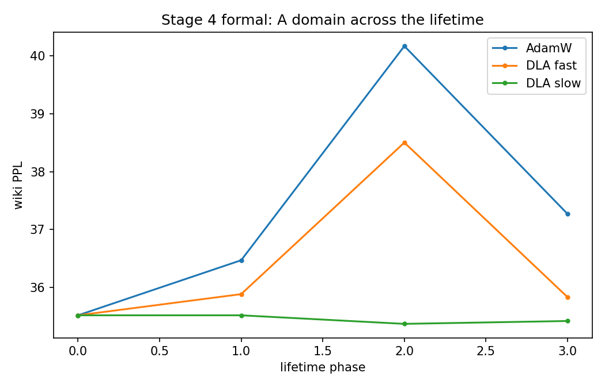
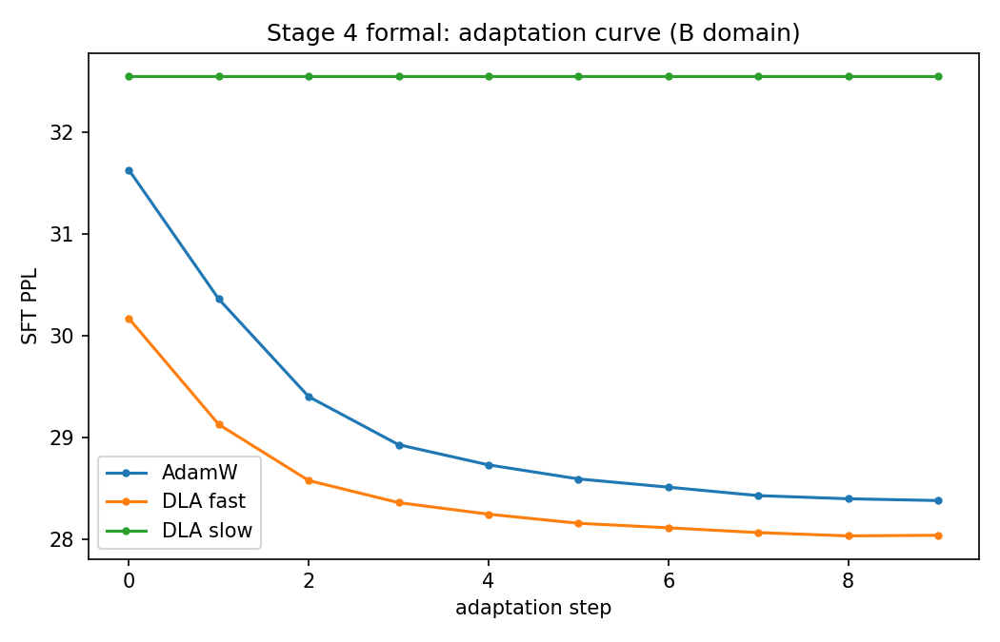
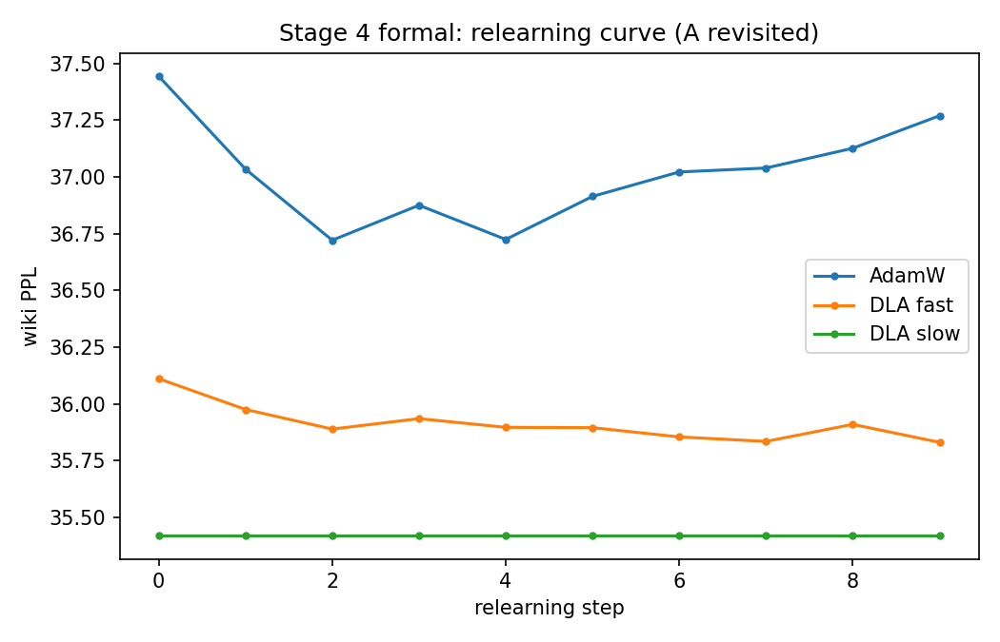
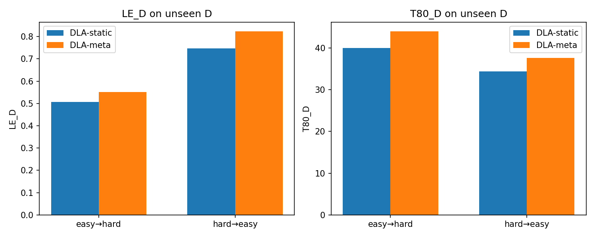
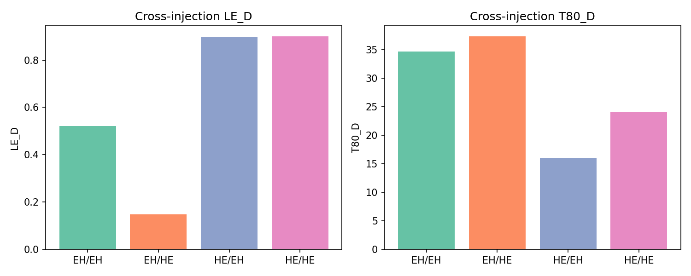
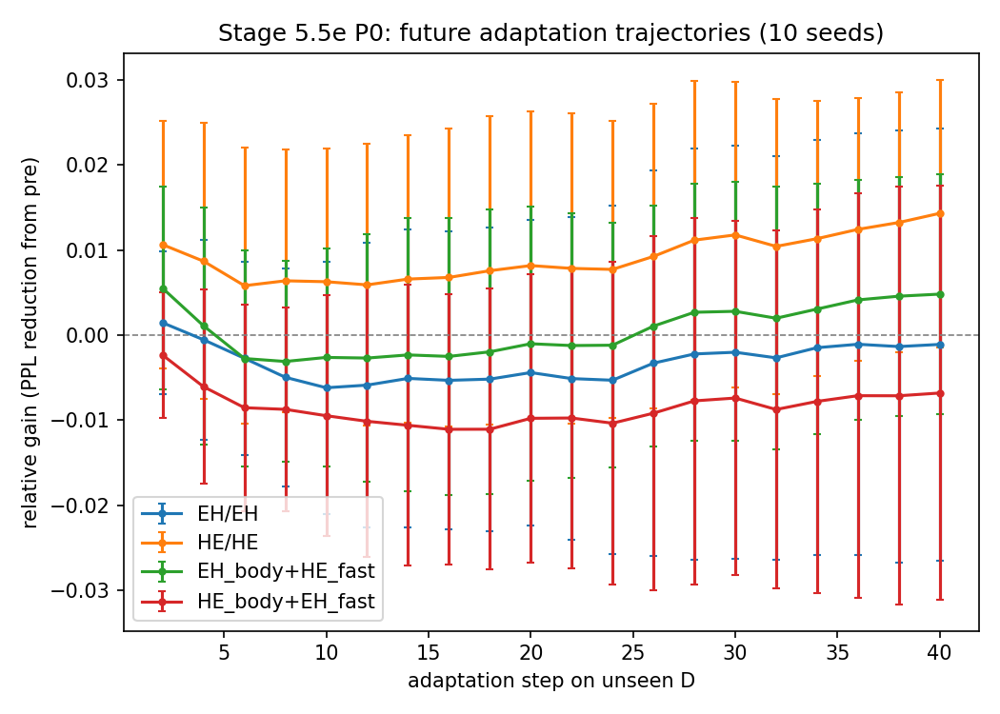
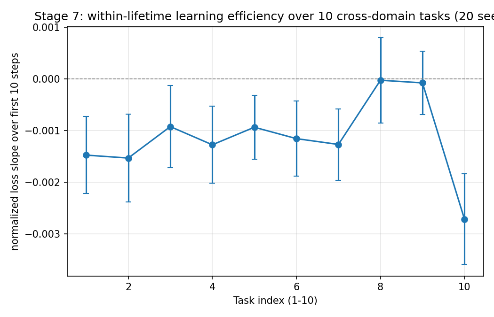
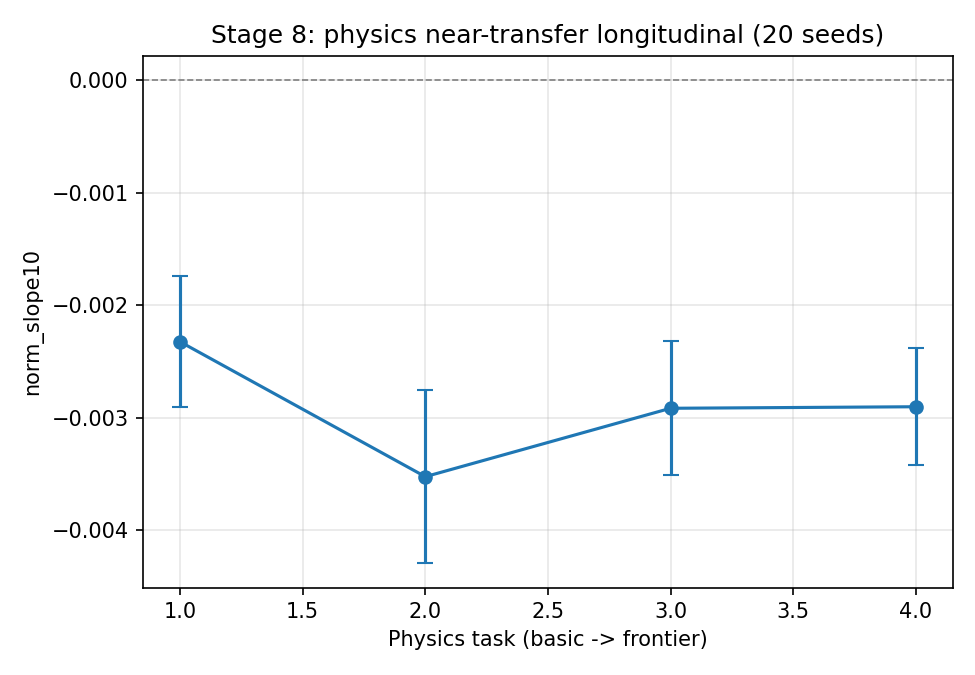

# Developmental Learning Architecture: Learning History, Fast-Weight Traces, and Future Adaptation

**First author: Yang Liu**

**Draft v0.2 (validation-stage) — workshop/arXiv**

---

## Abstract

A conventional neural learner is treated as a fixed function trained once by an external optimizer. This paper studies a more developmental question: does a learner's prior learning history change how it will learn in the future, and which internal state carries this effect? We propose a Developmental Learning Architecture (DLA) that keeps standard MLP/Transformer backbones unchanged but augments each weight with per-parameter fast weights, plasticity, and sleep consolidation. In a 6.59M Chinese character GPT we find that different curriculum histories lead to different future adaptation on an unseen domain, and that this effect is causally tied to the fast-weight state `W_fast`: replacing a hard→easy learner's fast weights with an easy→hard learner's significantly degrades future adaptation (n=12, gain@40 difference −0.019, bootstrap CI excludes zero, Cohen's d≈−0.7). Norm-matching and shuffling do not remove the effect, so it is not explained by weight magnitude or random parameter noise. The effect replicates on a second Shakespeare character-level backbone. We do not find evidence that more experience monotonically accelerates learning: multiple controlled longitudinal studies return null results. The conclusion is that learning history leaves a persistent, partially localizable trace in transient learner state, with `W_fast` providing a causal component of history-dependent future adaptation.

---

## 1. Introduction

### 1.1 What problem exists

Modern neural networks are trained and then frozen. When they learn a second task, they either overwrite the first (catastrophic forgetting) or treat the two tasks as independent. More fundamentally, standard training does not allow the model itself to become a different kind of learner: the learning algorithm is fixed outside the model.

We ask a problem that sits before "continual learning" and "meta-learning":

> Can what a model has experienced change how it will learn in the future, and which part of the model carries that developmental change?

### 1.2 Why it matters

If learning history only changes stored knowledge, the learner remains a static function with a growing database. If learning history also changes the learner state, then a small model could, in principle, become a better learner through experience—without changing its architecture. This is the key motivation for "growing models" and for understanding whether development is a meaningful object in machine learning.

The practical significance is twofold. First, it tells us which parts of a model to preserve or transfer between learning phases. Second, it gives a falsifiable framework for claims such as "more experience makes models learn faster" — a claim we test and do not find support for.

---

## 2. How existing work addresses the problem

- **Catastrophic forgetting methods** (regularization, replay, EWC) address memory, not the change of the learner itself.
- **Fast-weight models** add a temporary memory but usually keep the learning rule external.
- **Meta-learning** optimizes a learning rule over many episodes; it asks whether a rule can be learned, but rarely whether one individual's rule develops within a single lifetime.
- **Learned plasticity** (differentiable plasticity, ANML) shows that plasticity can be meta-learned, but does not separate *body state* from *learning-rule parameters* as causal carriers.
- **We therefore design DLA** to ask a mechanistic question that is usually skipped: given the same task sequence, which state component carries history-dependent future adaptation?

---

## 3. Our solution: DLA

### 3.1 Design principle

We do not modify the Transformer skeleton. Instead, each weight matrix is accompanied by:

- `W_slow`: long-term consolidated knowledge
- `W_fast`: a fast learning trace
- `P`: per-parameter plasticity
- `Q`: sleep eligibility trace

Effective weights:

```
W_eff = W_slow + softplus(P) * W_fast
```

### 3.2 Wake and sleep

During learning, `W_fast` is updated with Adam-style moments, gated by `softplus(P)`. At task boundaries (sleep), part of `W_fast` is consolidated into `W_slow` through `Q`, and `W_fast` is decayed. This is the fast/slow separation.

### 3.3 Experimental design to isolate development

To test whether history changes the future learner, we:

1. Build two histories with the same three domains but different order:
   - easy→hard (EH)
   - hard→easy (HE)
2. Probe each individual on a never-seen domain `D`.
3. Perform body/component cross-injection to see which state component transfers the history effect.
4. Run norm-matched, shuffled, and module-localized controls to rule out magnitude/randomness.
5. Compare with standard baselines (AdamW, replay, EWC).

---

## 4. Experimental setup

Primary backbone: 6.59M Chinese character GPT (6 layers, 8 heads, 256 dim, vocab 7280), pretrained on Chinese Wikipedia. Curriculum domains: Wikipedia, SFT-style QA, science Wikipedia; unseen domain D is a science slice. Second setting: ~10.65M Shakespeare character GPT (vocab 65). Metrics: gain@40, LE_D, T80, paired bootstrap CI, sign test.

---

## 5. Results: how well does it work

### 5.1 Fast/slow separation protects consolidated memory

DLA matches tuned AdamW on new-domain adaptation (gain +14.0% vs +13.0%) while slow-memory forgetting is ≈0 (−0.4%). This shows the mechanism does not sacrifice memory for plasticity.







### 5.2 Learning history changes future adaptation

Across histories, HE learners adapt better to unseen D than EH learners. This is not unique to DLA; but DLA is most robust after a difficult history.



### 5.3 The effect is not carried by the learning-rule parameters φ

Body×φ cross-injection shows that swapping φ between histories changes future adaptation much less than swapping body state. φ is not a stable/dominant carrier in this setting.



### 5.4 W_fast is a causal component

Core result (n=12):

| condition | mean gain@40 |
|---|---|
| HE/HE | +0.014 |
| HE + EH W_fast | −0.005 |

Paired HE→raw EH: mean −0.019, 95% CI [−0.033, −0.005], Cohen's d ≈ −0.71, sign p=0.019 (10/12 negative). Initial PPL differences are small; the effect appears in the adaptation trajectory.



### 5.5 Controls: magnitude, randomness, module

| control | mean Δ gain@40 | 95% CI | d |
|---|---|---|---|
| raw EH W_fast | −0.019 | [−0.034, −0.005] | −0.71 |
| norm-matched EH W_fast | −0.022 | [−0.034, −0.009] | −0.90 |
| shuffled EH W_fast | −0.017 | [−0.023, −0.009] | −1.25 |
| EH embedding W_fast | −0.006 | [−0.009, −0.002] | −0.87 |
| EH attention W_fast | −0.012 | [−0.018, −0.006] | −1.06 |
| EH MLP W_fast | −0.017 | [−0.025, −0.008] | −1.05 |

Norm-matching does not rescue the effect; shuffling also does not remove it. Module localization is suggestive of MLP and attention, with embedding weaker.


### 5.6 Fair baselines

| method | EH | HE | HE−EH |
|---|---|---|---|
| AdamW | 0.339 | 0.675 | +0.336 |
| AdamW+replay | 0.375 | 0.961 | +0.586 |
| EWC | 0.292 | 0.895 | +0.603 |
| DLA | 0.517 | 0.709 | +0.192 |

DLA is the most robust after an easy→hard history; standard learners show larger HE performance but larger EH degradation.

### 5.7 Second-setting replication

Shakespeare char GPT, 2 seeds: HE/HE gain@40 +0.052/+0.042; HE+EH fast +0.004/−0.001. The destructive effect replicates in direction.

### 5.8 Negative result: more experience does not necessarily make learning faster

Stage 5 (difficulty-normalized): flat LE. Stage 6 (matched difficulty): p=0.17. Stage 7 (cross-domain, 20 seeds): p=0.82. Stage 8 (physics near-transfer, 20 seeds): d=−0.17. We therefore do not claim "more experience → faster learning".





---

## 6. Limitations

- Second-setting n=2; baselines n=5.
- Single small backbones; no large-scale validation.
- Sleep consolidation writes only a small amount into `W_slow`; fast/slow separation is mostly isolation.
- No pre-registration; we report n=10→n=12 transparently.
- We cannot yet claim W_fast is the only carrier or that module localization is definitive.

---

## 7. Conclusion and significance

The learner is not fully characterized by what it currently knows. Learning history leaves a persistent, partially localizable trace in transient learner state, with `W_fast` providing a causal component of history-dependent future adaptation. This result gives a concrete mechanism for "development" in neural networks and clarifies a frequent but unsupported claim: developmental change does not equal universally faster learning.

---

## Reproducibility

Code: https://github.com/JayCRL/DLA
Experiment details: `docs/experiments.md`, `paper/overnight_report.md`, `paper/validation_audit.md`
Scripts: `stage4_formal.py`, `stage55e_wfast_p0.py`, `validation_p0_controls.py`, `validation_baselines.py`, `validation_second_setting.py`, `stage6_longitudinal.py`, `stage7_cross_domain.py`, `stage8_physics.py`.

---

## References

- Hinton & Plaut (1987). Using fast weights to deblur old memories.
- Ba et al. (2016). Using fast weights to attend to the recent past.
- Zenke et al. (2017). Continual learning through synaptic intelligence.
- Kirkpatrick et al. (2017). Overcoming catastrophic forgetting.
- Andrychowicz et al. (2016). Learning to learn by gradient descent.
- Miconi et al. (2019). Differentiable plasticity.
- Beaulieu et al. (2020). Learning to continually learn.
- Robins (1995). Catastrophic forgetting, rehearsal and pseudorehearsal.
